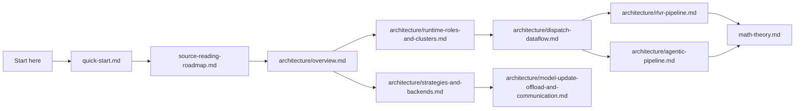

# ROLL Deep Dive: Code-Oriented Learning Path

If the official README tells you **what ROLL can do**, this tutorial set tells you **how ROLL is actually built**.

This guide is written for engineers who want to read the code with confidence: system architects, RL researchers, infrastructure engineers, and anyone who needs to understand how Ray scheduling, heterogeneous backends, reward computation, and PPO-style updates are wired together.

## What makes ROLL interesting

ROLL is not just "a PPO trainer". It is a distributed runtime that must solve several hard problems at the same time:

- Training and generation often want **different backends**.
- Reward computation may be **rule-based, model-based, or environment-based**.
- Large clusters waste money if GPUs sit idle during rollout, rewarding, or model synchronization.
- Agentic RL creates **long, irregular trajectories**, which stress both memory and scheduling.

ROLL answers these problems with a layered design: `Pipeline -> Cluster -> Worker -> Strategy -> Backend`.

## Recommended reading order

| If your question is... | Read this page first |
| --- | --- |
| "How do I get productive in 15 minutes?" | [`quick-start.md`](quick-start.md) |
| "Which files matter most?" | [`source-reading-roadmap.md`](source-reading-roadmap.md) |
| "What is the macro architecture?" | [`architecture/overview.md`](architecture/overview.md) |
| "How are roles placed onto GPUs and Ray actors?" | [`architecture/runtime-roles-and-clusters.md`](architecture/runtime-roles-and-clusters.md) |
| "How does a batch move through the runtime?" | [`architecture/dispatch-dataflow.md`](architecture/dispatch-dataflow.md) |
| "How does RLVR training run end to end?" | [`architecture/rlvr-pipeline.md`](architecture/rlvr-pipeline.md) |
| "How does Agentic RL differ from RLVR?" | [`architecture/agentic-pipeline.md`](architecture/agentic-pipeline.md) |
| "How do Megatron, DeepSpeed, vLLM, and SGLang fit together?" | [`architecture/strategies-and-backends.md`](architecture/strategies-and-backends.md) |
| "How do KL, PPO clip, GAE, token rewards, and batch balancing work?" | [`math-theory.md`](math-theory.md) |
| "How are model updates, offload, NCCL groups, and partial-GPU routing done?" | [`architecture/model-update-offload-and-communication.md`](architecture/model-update-offload-and-communication.md) |

## Primary source anchors

These pages are grounded in the following files:

- `examples/start_rlvr_pipeline.py`
- `examples/start_agentic_pipeline.py`
- `roll/pipeline/base_pipeline.py`
- `roll/pipeline/base_worker.py`
- `roll/pipeline/rlvr/rlvr_pipeline.py`
- `roll/pipeline/agentic/agentic_pipeline.py`
- `roll/distributed/executor/cluster.py`
- `roll/distributed/executor/worker.py`
- `roll/distributed/scheduler/decorator.py`
- `roll/distributed/scheduler/protocol.py`
- `roll/distributed/scheduler/generate_scheduler.py`
- `roll/distributed/scheduler/rollout_scheduler.py`
- `roll/distributed/scheduler/router.py`
- `roll/distributed/strategy/factory.py`
- `roll/distributed/strategy/strategy.py`
- `roll/utils/functionals.py`
- `roll/utils/kl_controller.py`
- `roll/utils/offload_nccl.py`

## One-sentence mental model

**ROLL is a Ray-orchestrated RL operating system for LLMs: pipelines decide the training loop, clusters own resources, workers execute role-specific logic, strategies abstract backend differences, and `DataProto` is the shared cargo container that moves data across the whole system.**
