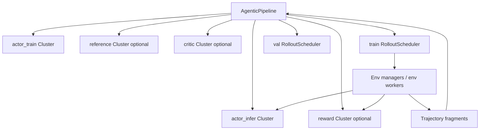
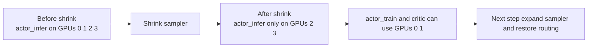

# Agentic Pipeline Deep Dive

Agentic RL is where ROLL stops treating the model as a one-shot answer generator and starts treating it as an interactive policy that acts across trajectories.

Primary source anchors:

- `roll/pipeline/agentic/agentic_pipeline.py`
- `roll/pipeline/agentic/agentic_config.py`
- `roll/distributed/scheduler/rollout_scheduler.py`
- `roll/distributed/scheduler/router.py`
- `roll/pipeline/agentic/utils.py`

## 1. The conceptual jump from RLVR to Agentic RL

RLVR asks: "Was this answer correct?"

Agentic RL asks: "How did the policy behave across multiple interaction steps, possibly with environments or tools in the loop?"

That difference changes almost everything about scheduling.

## 2. Macro architecture

## 3. What makes the scheduler harder here

In RLVR, one prompt usually becomes one response group.

In Agentic RL, a rollout may involve:

- multiple turns,
- multiple environments,
- partial completion,
- redundant groups,
- async windows,
- hung or slow environments.

That is why `rollout_scheduler.py` contains objects like:

- `GroupQueue`
- `GroupQueueManager`
- `EnvActivityMonitor`

## 4. Reading the training loop by phases

The code is nicely commented, and the phases are worth memorizing.

### Phase 1: offload training-side states

Training-side models may offload state to free memory before rollout-sensitive work.

### Phase 2: suspend the rollout scheduler and optionally stop generation service

This prevents new requests from racing with model synchronization.

### Phase 3: model update

Actor train weights are pushed to actor infer.

### Phase 4: reload actor infer and reward state

Now the serving side is ready again.

### Phase 5: expand sampler in partial GPU mode

If ROLL previously shrank inference off some GPUs, it restores the active routing state.

### Phase 6: async validation if needed

Validation can run through the thread pool.

### Phase 7: get rollout batch

`train_rollout_scheduler.get_batch(...)` gathers trajectories from env interaction.

### Phase 8: stop or suspend serving side as needed

This protects the next training stage.

### Phase 9: shrink sampler in partial GPU mode

ROLL can free training GPUs by offloading inference workers from a subset of devices.

## 5. Partial GPU mode: why it exists

Partial GPU mode is one of the most system-savvy ideas in the repo.

The goal is simple:

- keep inference alive where needed,
- but do not let it occupy GPUs that training now needs.

### Daily-life analogy

Imagine a restaurant kitchen with four burners.

During lunch, all four burners cook customer orders. During prep time, two burners are enough for live orders, so the other two are freed for bulk sauce preparation. Partial GPU mode does the same thing for cluster resources.

## 6. Why `RouterManager` matters so much

`RouterManager` is the traffic cop for infer requests.

It can:

- route requests by prompt or environment affinity,
- suspend new traffic,
- wait for inflight work to drain,
- shrink or expand active workers.

Without this control plane, agentic rollout would be far more fragile during model updates.

## 7. Environment monitoring is not optional fluff

`EnvActivityMonitor` records episode start and submit times, then detects hung environments.

This matters because long-lived environment loops can silently stall a training system if nobody watches them.

In large runs, observability is part of correctness.

## 8. Where the math differs from RLVR

The policy-gradient core still resembles PPO-style RL, but the reward/return side can become trajectory- or segment-aware.

In `agentic/utils.py`, ROLL supports segmented return logic where only specific masked spans are treated as actionable parts of the trajectory.

This is important because not every token in an agent trace represents a meaningful decision.

## 9. Why Agentic RL is harder than it looks

The hard part is not just "multi-turn generation." The hard part is coordinating:

- serving,
- environment execution,
- reward access,
- validation,
- model synchronization,
- GPU reuse,
- failure detection.

AgenticPipeline exists because these concerns need a first-class runtime, not a pile of callbacks.

## 10. The simplest intuition

RLVR is like grading exam sheets.

Agentic RL is like coaching a player during a match where every move changes the future state of the game.

The second problem needs a scheduler, not just a scorer.

## 11. What to read next

- runtime roles: [`runtime-roles-and-clusters.md`](runtime-roles-and-clusters.md)
- formulas and segmented returns: [`../math-theory.md`](../math-theory.md)
- routing and memory reuse: [`model-update-offload-and-communication.md`](model-update-offload-and-communication.md)
