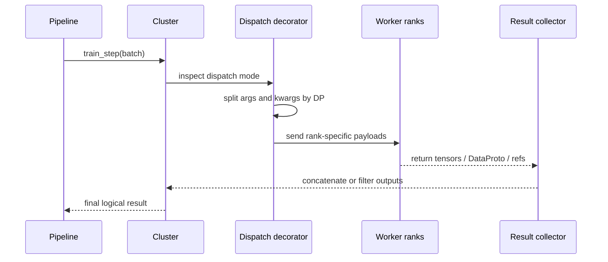
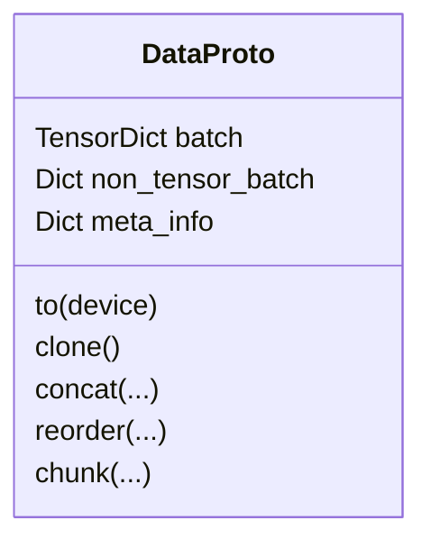

# Dispatch, Data Flow, and `DataProto`

This page explains one of the most elegant parts of ROLL: a cluster method can look simple from the outside, while the decorator system handles splitting, dispatching, and collecting data across ranks.

Primary source anchors:

- `roll/distributed/scheduler/decorator.py`
- `roll/distributed/scheduler/protocol.py`
- `roll/distributed/executor/cluster.py`
- `roll/utils/functionals.py`

## 1. Why the decorator layer exists

A pipeline wants to say something simple like:

```python
actor_train.train_step(batch)
```

But in reality, that one line may need to do all of the following:

- split the batch by data-parallel group,
- dispatch the right slices to multiple workers,
- avoid redundant full payloads on non-primary TP/CP/PP ranks,
- collect outputs only from meaningful ranks,
- optionally concatenate partial results back into one `DataProto`.

The decorator system is how ROLL hides this complexity without lying about it.

## 2. The dispatch modes

| Dispatch mode | Meaning |
| --- | --- |
| `ONE_TO_ALL` | send the same input to every worker |
| `ALL_TO_ALL` | caller provides one input per worker |
| `DP_MP_COMPUTE` | split by DP, then fan out within model-parallel ranks |
| `DP_MP_DISPATCH_FIRST` | same as above, but only the first MP rank gets the full payload |

The most important collector rule is in `collect_dp_mp_compute()`: only outputs from `tp_rank == 0`, `cp_rank == 0`, and pipeline-last-stage are considered the meaningful representatives.

## 3. Sequence of one decorated call



## 4. Why `DP_MP_DISPATCH_FIRST` is clever

Suppose a model has `DP=2` and `TP=2`. That means each logical DP shard has two TP ranks.

If you blindly send the full `DataProto` to every TP rank, you waste memory and transport.

`DP_MP_DISPATCH_FIRST` says:

- within each DP group, the first MP rank gets the real payload,
- the other MP ranks get a metadata-only placeholder if possible.

That lowers communication and memory duplication while preserving control semantics.

## 5. `DataProto` is the cargo container

`DataProto` contains three compartments:

| Field | Meaning |
| --- | --- |
| `batch` | tensor data stored as a `TensorDict` |
| `non_tensor_batch` | object arrays such as UUIDs, tags, domains, trajectory IDs |
| `meta_info` | runtime metadata such as metrics, generation config, masks, and control flags |



## 6. Why `DataProto` matters so much

Without a standard container, every module boundary would need custom glue code.

With `DataProto`, the scheduler, worker, and strategy layers can exchange a single object even when the payload contains:

- token tensors,
- domain labels,
- reward metrics,
- request IDs,
- rollout bookkeeping.

## 7. A tiny DP example

Imagine a batch of 8 samples and `DP=2`.

`_split_args_kwargs()` divides that batch into two 4-sample chunks.

- DP rank 0 gets samples `0-3`
- DP rank 1 gets samples `4-7`

If each DP shard also has TP ranks, the decorator fan-out duplicates only what is needed inside that shard.

## 8. Padding and unpadding are not side details

`pad_dataproto_to_divisor()` and `unpad_dataproto()` exist because many collective or model-parallel paths work best when batch sizes are divisible by some world size or shard size.

In plain words: sometimes the system briefly adds fake luggage so that every truck leaves with the same number of boxes, then throws the fake luggage away after transport.

## 9. How balancing connects to data flow

`batch_balance()` reorders samples so each DP partition gets similar estimated workload.

This is not only about fairness; it reduces idle time. If one DP rank gets all the long sequences, everybody else waits.

## 10. The deepest intuition

The dispatch layer is the boundary between **logical intent** and **physical execution**.

The pipeline says, "train on this batch."
The decorator system translates that into, "which ranks need which slices, and whose outputs count?"

That translation layer is a major reason the rest of the code remains readable.

## 11. What to read next

- RLVR loop: [`rlvr-pipeline.md`](rlvr-pipeline.md)
- Agentic loop: [`agentic-pipeline.md`](agentic-pipeline.md)
- backend contracts: [`strategies-and-backends.md`](strategies-and-backends.md)
