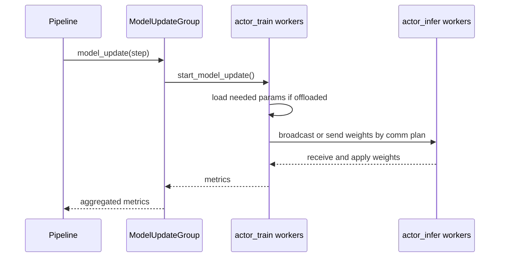
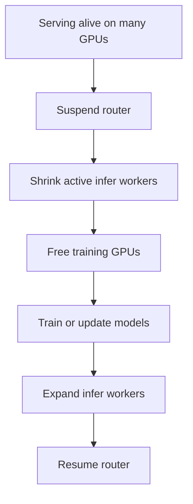

# Model Update, Offload, and Communication

This page explains how ROLL moves weights, pauses inference safely, and reclaims memory without tearing the whole runtime apart.

Primary source anchors:

- `roll/distributed/executor/model_update_group.py`
- `roll/distributed/executor/worker.py`
- `roll/distributed/strategy/strategy.py`
- `roll/distributed/scheduler/router.py`
- `roll/utils/offload_nccl.py`
- `roll/distributed/scheduler/resource_manager.py`

## 1. The real bottleneck at scale

In large RL runs, the expensive part is often not the formula itself. It is the coordination cost around the formula:

- copying new policy weights to serving workers,
- pausing request traffic at the right moment,
- freeing GPU memory temporarily,
- rebuilding communication state safely.

ROLL contains explicit machinery for all of these.

## 2. Model update path

`ModelUpdateGroup` ties a source cluster to a target cluster, usually `actor_train -> actor_infer`.

## 3. Why communication groups are preplanned

In `strategy.py`, collective groups are built from a communication plan.

The strategy decides:

- which worker is sender,
- which workers are receivers,
- which group name and master address/port to use,
- how many ranks participate.

This matters because model update is not a casual `state_dict` copy. It is a distributed transport problem.

## 4. Worker-side offload lifecycle

The base `Worker` exposes:

- `load_states()`
- `offload_states()`
- `start_model_update()`

The key idea is simple:

- when a role is not actively needed, offload or unload states,
- when a phase needs that role again, reload only what is necessary.

This gives the pipeline a lever to trade time for memory.

## 5. Reloadable NCCL groups: the subtle trick

`offload_nccl.py` monkey-patches `torch.distributed.new_group()` so NCCL groups become `ReloadableProcessGroup` objects.

Why is that useful?

Because the system can:

- destroy process groups to free resources,
- later recreate them with the same rank membership.

That is a rare but powerful systems trick. It lets memory-sensitive workflows survive phase changes that would otherwise keep stale communication state alive.

## 6. Router suspend/resume is about correctness, not convenience

`RouterManager` can:

- suspend new requests,
- abort existing requests,
- wait until inflight traffic drains,
- resume once the serving side is valid again.

Without this, the system could easily mix requests generated from old weights with requests generated from new weights in the same conceptual step.

## 7. Partial GPU manager: reclaiming serving GPUs

The `PartialGPUManager` in `router.py` maps target GPU IDs to data-parallel ranks, then shrinks or expands active infer workers.

This is especially important in Agentic RL where serving and training phases alternate and may want overlapping but not identical device sets.

## 8. Physical intuition: moving water tanks

Think of model parameters as water and GPUs as tanks.

- training fills the newest water into the train-side tanks,
- model update pipes the water into infer-side tanks,
- offload means temporarily pumping water into cheaper storage,
- router suspend means closing customer taps during the pipe reconfiguration.

If you skip the tap-closing step, customers get a mix of old and new water.

## 9. Why `ResourceManager` still matters here

Communication and offload are not abstract. They depend on where ranks actually live.

`ResourceManager` is what makes it possible to know:

- which GPUs belong to which node,
- which device IDs form a worker,
- how to convert a global GPU ID into `node_rank + gpu_rank`.

This is why partial-GPU routing can be expressed in high-level GPU IDs and still work correctly.

## 10. Practical bottleneck map

| Bottleneck | ROLL mechanism |
| --- | --- |
| infer serving uses stale weights | `ModelUpdateGroup` + strategy comm plan |
| inflight requests cross step boundaries | `RouterManager.suspend()` and `wait_complete()` |
| memory pressure from inactive roles | `offload_states()` and `load_states()` |
| process groups consume resources after phase change | `ReloadableProcessGroup` |
| train and infer fight for the same GPUs | partial-GPU shrink/expand |

## 11. The big takeaway

Many frameworks explain optimization math and stop there.

ROLL goes further: it treats **weight transport, memory lifecycles, and request routing** as first-class parts of RL training.

That is why its architecture feels closer to a distributed serving system plus optimizer, rather than a single monolithic trainer.
