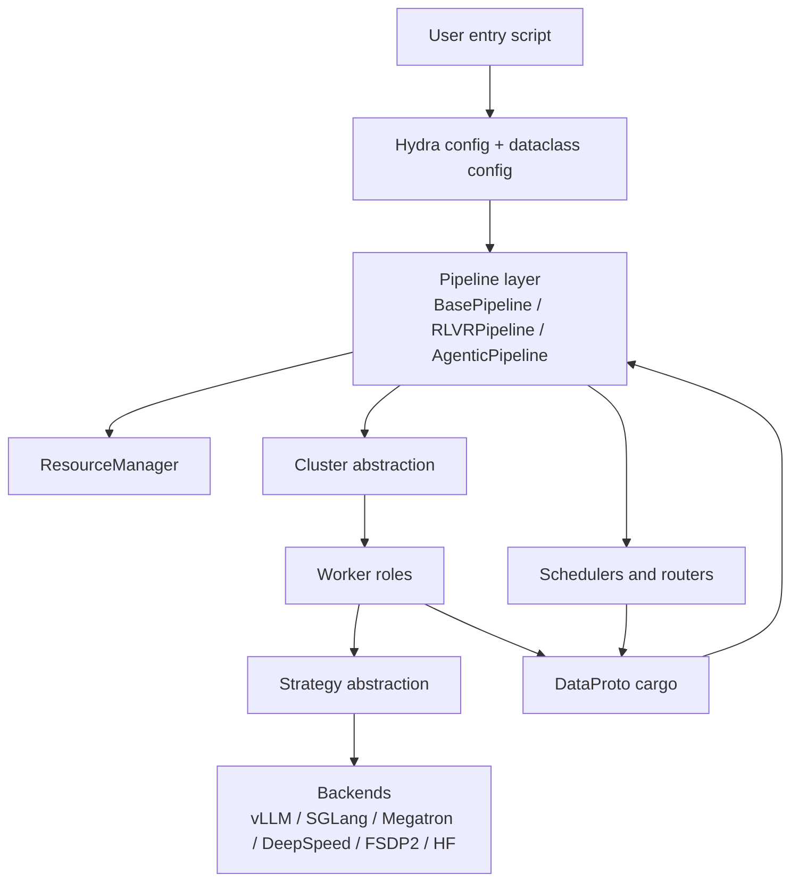
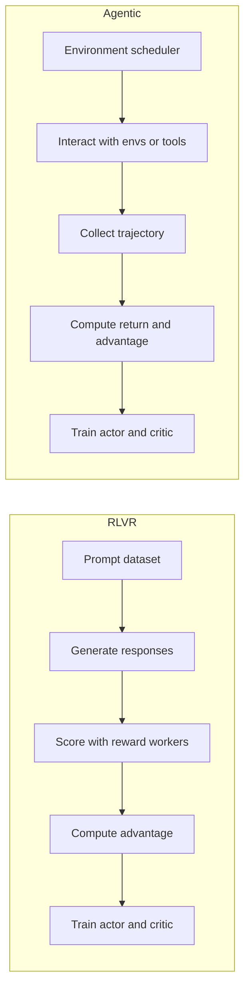

# Architecture Overview

ROLL is easiest to understand if you stop thinking of it as a single trainer and start thinking of it as a **distributed control system for RL post-training**.

## 1. The industry problem ROLL is solving

Large-model RL training is hard for three reasons at once:

- the policy model needs both **generation** and **training** paths,
- the reward path can be heterogeneous and dynamic,
- the cluster must survive long rollouts, weight sync, and memory pressure without wasting GPUs.

A naive design would put everything into one monolithic process. ROLL does the opposite: it splits the system into roles and gives each role the engine that suits it best.

## 2. The macro skeleton

## 3. The five architectural ideas that matter most

### 3.1 Pipelines own time

A pipeline decides the order of phases inside each training step:

- rollout / generation,
- reward or environment interaction,
- reference and old log-prob computation,
- advantage construction,
- actor/critic update,
- checkpointing and logging.

### 3.2 Clusters own placement

A `Cluster` wraps a set of Ray actors and knows how they map to ranks, nodes, and devices.

### 3.3 Workers own role semantics

A worker is not just "a process". It is a role-specific operator such as actor, infer server, critic, reward worker, or environment worker.

### 3.4 Strategies own backend differences

The worker asks for high-level operations like `generate`, `forward_step`, or `setup_model_update`. The strategy decides how that is implemented for vLLM, SGLang, Megatron, DeepSpeed, or FSDP2.

### 3.5 `DataProto` owns transport

`DataProto` is the standard container used to move tensors, non-tensor metadata, and runtime annotations across schedulers, clusters, workers, and strategies.

## 4. Two big pipelines, one shared runtime philosophy

The loops differ, but the design vocabulary stays the same:

- clusterized roles,
- backend abstraction,
- explicit scheduling,
- shared batch protocol,
- configurable reward/advantage logic.

## 5. Why this layered design is powerful

It lets ROLL mix heterogeneous engines without forcing one engine to do everything.

Example:

- actor training can use Megatron or DeepSpeed,
- actor inference can use vLLM or SGLang,
- reward can come from rules, a reference model, or a dedicated infer cluster,
- agentic rollout can use a different scheduler from RLVR rollout.

That is the architectural reason ROLL can scale from a small local setup to a very large cluster without rewriting the whole stack.

## 6. The plain-English analogy

Imagine a movie production:

- the **pipeline** is the production schedule,
- the **clusters** are departments,
- the **workers** are the actors, camera crews, and editors,
- the **strategies** are the tools each department uses,
- `DataProto` is the standardized box in which every department ships material to the next.

A good movie does not happen because everyone uses the same tool. It happens because everyone follows the same contract.

## 7. What to read next

- For placement and roles: [`runtime-roles-and-clusters.md`](runtime-roles-and-clusters.md)
- For dispatch and `DataProto`: [`dispatch-dataflow.md`](dispatch-dataflow.md)
- For concrete loops: [`rlvr-pipeline.md`](rlvr-pipeline.md) and [`agentic-pipeline.md`](agentic-pipeline.md)
