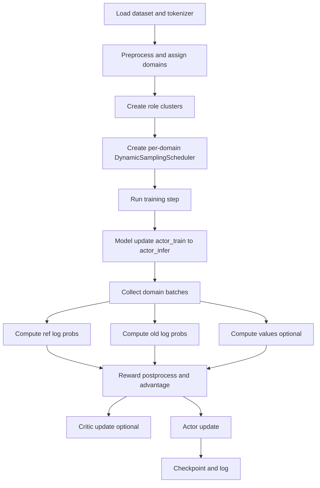

# RLVR Pipeline Deep Dive

RLVR stands for **Reinforcement Learning with Verifiable Rewards**. In ROLL, it is the path used when the system can judge model outputs by rules, executable checks, reward models, or LLM-as-judge workers.

Primary source anchors:

- `roll/pipeline/rlvr/rlvr_pipeline.py`
- `roll/pipeline/rlvr/rlvr_config.py`
- `roll/pipeline/base_pipeline.py`
- `roll/pipeline/base_worker.py`
- `roll/distributed/scheduler/generate_scheduler.py`
- `roll/utils/functionals.py`

## 1. The one-paragraph story

RLVRPipeline loads and preprocesses datasets, splits them by domain, creates role clusters, builds one dynamic generation scheduler per domain, collects rollouts, computes rewards and advantages, then updates actor and optional critic models.

## 2. Why domains are first-class citizens

ROLL does not assume that all prompts are the same kind of task.

The pipeline can keep separate domain datasets such as:

- math
- code
- reasoning
- instruction following

Each domain can have:

- its own reward worker,
- its own sampling ratio,
- its own batch allocation inside one training step.

## 3. Macro flow

## 4. Bootstrap phase

During initialization, `RLVRPipeline` does four big things.

### 4.1 Build datasets and encode prompts

`preprocess_dataset()` applies template formatting, tokenization, and prompt-length filtering.

### 4.2 Build domain views

After mapping tags to domains, the pipeline creates `self.domain_datasets[domain]` by filtering the master dataset. This is what lets domain schedulers act independently.

### 4.3 Build role clusters

Typical roles include:

- `actor_train`
- `actor_infer`
- `reference` if KL reference is enabled
- `critic` if `adv_estimator == "gae"`
- per-domain reward clusters
- optional shared `reward_model_cluster`

### 4.4 Build generation schedulers

Each domain gets a `DynamicSamplingScheduler`. That scheduler knows:

- which dataset to sample from,
- which infer cluster to call,
- which reward cluster to coordinate with,
- how many samples are expected for this step.

## 5. Domain batch sizing: a tiny example

Suppose `rollout_batch_size = 8` and `domain_interleave_probs = {math: 0.75, code: 0.25}`.

Then the pipeline allocates:

- 6 prompts to math
- 2 prompts to code

That sounds simple, but it matters: ROLL is doing multi-domain RL without flattening every task into the same bucket.

## 6. What happens inside one training step

### Step 1: sync train weights to infer weights

`self.model_update(global_step)` uses `ModelUpdateGroup` to push actor_train weights to actor_infer.

This keeps rollout generation aligned with the latest training state.

### Step 2: collect rollout data

Each domain scheduler produces a batch. Then the pipeline merges them with `DataProto.concat(...)`.

### Step 3: compute probabilities and values

On the collected batch, the pipeline may compute:

- reference log probs
- old actor log probs
- critic values

This is the point where the rollout becomes training material.

### Step 4: reward shaping and advantage

For each domain group, ROLL runs the classic processing chain:

- sample-level mask
- reward normalization and clipping
- token reward construction plus KL shaping
- advantage computation

### Step 5: train models

- critic update if GAE is used
- actor update after optional critic warmup

### Step 6: log and checkpoint

Metrics, scheduler state, RNG state, and checkpoints are recorded.

## 7. Why reward processing is grouped by domain

This is one of the best design choices in RLVRPipeline.

Different task families often need different reward behavior. A code execution reward and a boxed-answer math reward are not statistically identical. Domain grouping prevents one reward distribution from polluting another.

## 8. What `DynamicSamplingScheduler` is really doing

It is more than a queue. It is a flow controller that decides:

- when new prompts may be sent,
- how async windows are managed,
- how finished samples are grouped and returned,
- how many samples are enough to unblock the pipeline.

In other words, it bridges the gap between dataset iteration and irregular generation latency.

## 9. Why RLVR is system-friendly

RLVR has a natural advantage over fully subjective RLHF-style loops: the reward path can often be decomposed and parallelized cleanly.

That is why ROLL can combine:

- rule workers,
- code sandbox workers,
- reward-model infer clusters,
- standard actor/reference/critic paths.

## 10. The plain-English analogy

Think of RLVRPipeline as a factory with multiple production lines.

- each domain is a production line,
- `actor_infer` manufactures candidate outputs,
- reward workers inspect quality,
- actor_train learns from the accepted inspection signals.

The pipeline manager makes sure all lines feed the same training update without losing their local specialization.

## 11. What to read next

- dispatch/data transport: [`dispatch-dataflow.md`](dispatch-dataflow.md)
- formulas: [`../math-theory.md`](../math-theory.md)
- communication and offload: [`model-update-offload-and-communication.md`](model-update-offload-and-communication.md)
