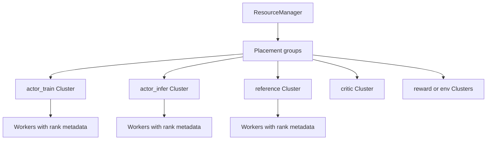
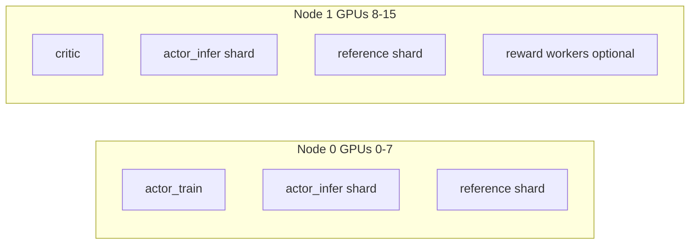

# Runtime Roles and Clusters

This page explains how ROLL turns abstract roles into concrete Ray workers running on specific GPUs.

Primary source anchors:

- `roll/distributed/scheduler/resource_manager.py`
- `roll/distributed/executor/cluster.py`
- `roll/distributed/executor/worker.py`
- `examples/docs_examples/example_ppo.yaml`

## 1. The big idea

In ROLL, a role such as `actor_train` or `actor_infer` is not created by hand-crafted ad hoc launch logic. Instead, the system builds a `Cluster` object from a `WorkerConfig`, and that cluster creates the right Ray actors on the right devices.

## 2. Core runtime objects

| Object | What it owns |
| --- | --- |
| `ResourceManager` | cluster-level placement groups and device accounting |
| `Cluster` | one logical role made of many workers |
| `Worker` | one Ray actor with rank metadata and runtime state |
| `RankInfo` | DP/TP/PP/CP coordinates for a worker |

## 3. How `ResourceManager` thinks

`ResourceManager` looks at Ray's available resources, selects nodes that satisfy `num_gpus_per_node`, creates placement groups, and records mappings such as `node_rank -> placement_group`.

The most important function is `allocate_placement_group(world_size, device_mapping)`.

That function translates a logical request like "I want 8 ranks on GPUs `[0..7]`" into a structured list of placement records containing:

- `node_rank`
- `gpu_rank`
- `placement_group`
- `ray_address`

## 4. How `Cluster` turns placement into workers

`Cluster._create_workers()` does several subtle but essential things:

- chooses the deployment placement group,
- sets distributed environment variables,
- records visible devices,
- creates one Ray actor per rank,
- fetches rank-0 master address and port.

This is why a cluster can later behave like a coherent distributed role instead of a bag of unrelated actors.

## 5. Worker naming is not cosmetic

Worker names look like `actor_train-0-G0` or `actor_infer-0-G01`.

That naming convention is useful because it encodes:

- cluster name,
- rank,
- visible GPU set.

When timelines or logs get messy, this is an underrated debugging gift.

## 6. Role vocabulary in ROLL

| Role | Typical job |
| --- | --- |
| `actor_train` | do forward/backward and update the policy |
| `actor_infer` | generate text or actions |
| `reference` | compute baseline log probabilities for KL control |
| `critic` | predict values for GAE |
| `reward` / `rewards` | compute scalar rewards or judgments |
| environment workers | run tool or environment interaction |

## 7. Concrete 16-GPU example

The example PPO config under `examples/docs_examples/example_ppo.yaml` is a great teaching case.

It shows a plausible layout like this:

- `actor_train` on GPUs `0-7`
- `actor_infer` on GPUs `0-15`
- `reference` on GPUs `0-15`
- `critic` on GPUs `8-15`

That means the same machine room may host overlapping logical roles, but each role still gets its own cluster object and its own lifecycle.

## 8. Why separate train and infer at all?

Because training and inference want different things.

- training wants optimizer state, backward passes, and possibly ZeRO or Megatron sharding,
- inference wants fast generation, KV-cache efficiency, and engines like vLLM or SGLang.

A split design means each side can use the engine that suits it best.

## 9. `Worker` is where distributed identity begins

The base `Worker` class initializes:

- `RANK`, `WORLD_SIZE`, `LOCAL_RANK`
- `MASTER_ADDR`, `MASTER_PORT`
- shared storage handles
- `RankInfo`

This is the moment a normal process becomes part of a coordinated distributed system.

## 10. The plain-English analogy

Think of `ResourceManager` as the airport tower, `Cluster` as one airline, and each `Worker` as one airplane.

- the tower decides runway access,
- the airline decides fleet membership,
- each plane knows its call sign and route.

Without all three, you do not have air traffic control; you have expensive chaos.

## 11. What to read next

- dispatch semantics: [`dispatch-dataflow.md`](dispatch-dataflow.md)
- RLVR loop: [`rlvr-pipeline.md`](rlvr-pipeline.md)
- communication/offload: [`model-update-offload-and-communication.md`](model-update-offload-and-communication.md)
