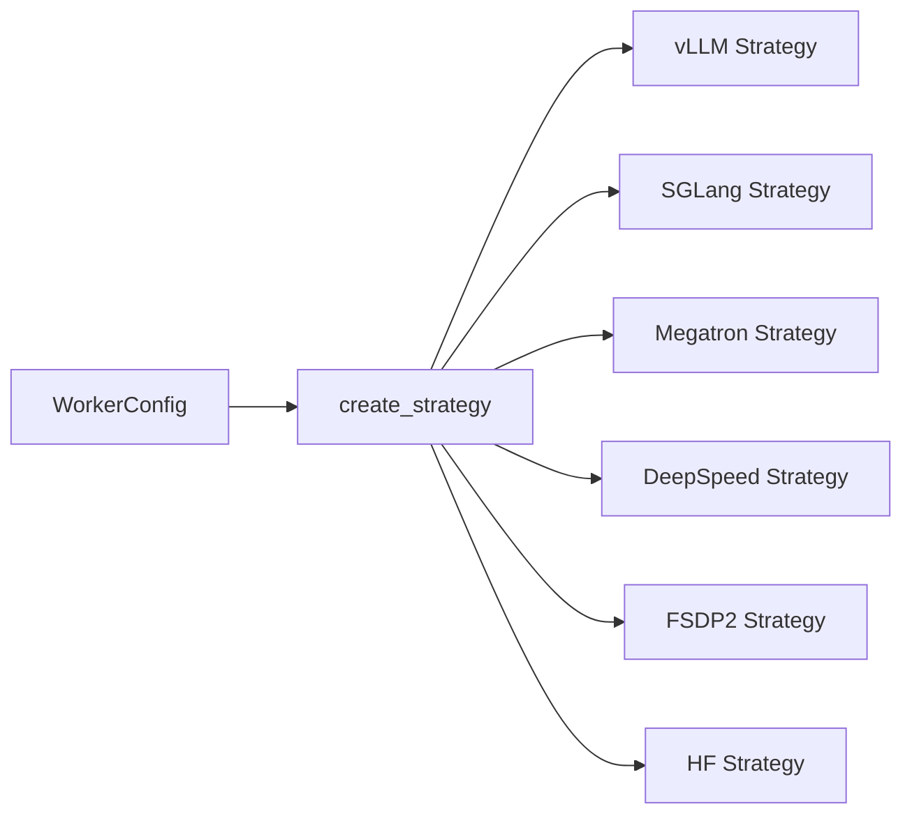

# Strategies and Backends

One of ROLL's strongest engineering decisions is that workers speak in terms of **strategy interfaces**, not raw backend APIs.

Primary source anchors:

- `roll/distributed/strategy/factory.py`
- `roll/distributed/strategy/strategy.py`
- `roll/distributed/strategy/vllm_strategy.py`
- `roll/distributed/strategy/sglang_strategy.py`
- `roll/distributed/strategy/megatron_strategy.py`
- `roll/distributed/strategy/deepspeed_strategy.py`
- `roll/distributed/strategy/fsdp2_strategy.py`

## 1. Why the strategy layer exists

Different roles want different engines.

- training likes Megatron, DeepSpeed, or FSDP2,
- inference likes vLLM or SGLang,
- some helper paths can use lightweight HF inference.

If workers directly depended on backend internals, the whole repo would be a mess of special cases.

Instead, `create_strategy(worker)` selects a strategy class from config and hands the worker a uniform interface.

## 2. Two contracts: inference and training

`strategy.py` defines the common shape.

### InferenceStrategy

It owns operations such as:

- `initialize`
- `generate`
- `forward_step`
- `load_states`
- `offload_states`
- model update collective setup

### TrainStrategy

It extends the idea toward optimization and model update operations needed by actor and critic workers.

## 3. Why this abstraction is more than software niceness

It lets one pipeline use **heterogeneous engines simultaneously**.

Example:

- actor training with Megatron,
- actor inference with vLLM,
- reward-model inference with another infer strategy,
- reference model with a different sharding shape.

That is a real systems advantage, not just clean code.

## 4. Backend cheat sheet

| Backend | Typical role | What it is good at |
| --- | --- | --- |
| vLLM | actor infer / reward infer | high-throughput text generation with KV-cache efficiency |
| SGLang | actor infer / tool-oriented serving | fast serving plus routing support |
| Megatron | actor train / reference infer | tensor and pipeline model parallel training at scale |
| DeepSpeed | actor or critic train | optimizer sharding and memory efficiency |
| FSDP2 | train or infer | modern PyTorch-native sharding path |
| HF | lightweight infer | simpler fallback or utility inference |

## 5. Common operations every backend must respect

The strategy interface exposes operations that pipelines rely on everywhere:

- `op_compute_log_probs`
- `op_compute_entropy`
- language loss helpers
- collective-group setup for model update
- offload/load lifecycle hooks

This is important: the algorithm layer can ask for "log probs" without caring whether the underlying model came from Megatron or vLLM-compatible inference.

## 6. Why async wrappers exist

vLLM and SGLang may expose async-style serving behavior. `factory.py` can wrap a strategy with a sync adapter so threaded Ray actors do not need to manually manage event loops everywhere.

This is a small implementation detail with a big payoff: worker code stays much cleaner.

## 7. Strategy is where distributed math becomes executable

In `strategy.py`, operations like `op_compute_log_probs` and `op_compute_various_divergence` are where abstract formulas become model-aware tensor ops.

This is also where sharded logits, attention masks, and distributed vocabulary gathering get normalized into a common worker-facing interface.

## 8. How to choose a backend mentally

Ask two questions.

### Question 1: is this role mostly generating or mostly training?

- mostly generating -> vLLM or SGLang is attractive
- mostly training -> Megatron, DeepSpeed, or FSDP2 is attractive

### Question 2: what is the cluster bottleneck?

- memory -> sharding/offload-friendly training backend
- serving throughput -> high-performance infer backend
- complex parallelism -> Megatron-style distributed strategy

## 9. Plain-English analogy

The worker says, "I need a vehicle that can deliver this payload."

The strategy decides whether the vehicle is a truck, train, or cargo plane.

The pipeline does not care about the vehicle brand. It only cares that the package arrives with the promised contract.

## 10. What to read next

- communication and offload path: [`model-update-offload-and-communication.md`](model-update-offload-and-communication.md)
- RLVR pipeline: [`rlvr-pipeline.md`](rlvr-pipeline.md)
- Agentic pipeline: [`agentic-pipeline.md`](agentic-pipeline.md)
