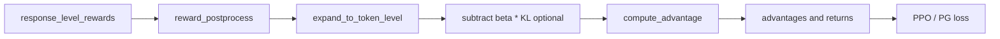

# Math Theory, but Made Intuitive

This page explains the key formulas behind ROLL in a way that stays faithful to the code while remaining intuitive.

Primary source anchors:

- `roll/pipeline/base_worker.py`
- `roll/utils/functionals.py`
- `roll/utils/kl_controller.py`
- `roll/pipeline/agentic/utils.py`



## 1. PPO ratio: "how much did the new policy change?"

In `base_worker.py`, the policy ratio is computed as:

$$
r_t = \exp\big(\log \pi_\theta(a_t\mid s_t) - \log \pi_{old}(a_t\mid s_t)\big)
$$

The symbols mean:

- $s_t$: the current state or token context
- $a_t$: the sampled action, which in LLM RL is usually the emitted token
- $\pi_\theta$: the current policy
- $\pi_{old}$: the old policy that produced the rollout
- $r_t$: how much the new policy increased or decreased the probability of the chosen action

### Grocery-market example

Imagine a fruit seller used to recommend apples with probability `0.20`, and now recommends them with probability `0.26`.

Then:

$$
r_t = 0.26 / 0.20 = 1.30
$$

So the new policy is **30% more confident** about the same decision.

PPO does not trust such changes blindly. It clips them:

$$
L_{clip} = -\min(r_t A_t, \text{clip}(r_t, 1-\epsilon, 1+\epsilon) A_t)
$$

In the code, this is implemented through `surr1`, `surr2`, and `torch.min(...)`.

If `pg_clip = 0.2`, then the allowed ratio band is `[0.8, 1.2]`. Even though `1.30` looks great, PPO behaves as if it were only `1.20` to avoid unstable jumps.

## 2. Why KL appears twice in ROLL

ROLL uses KL in two different ways.

### 2.1 KL as a reward-shaping penalty

In `compute_token_reward()` or `apply_kl_penalty()`, token reward can be adjusted by

$$
r^{token}_t \leftarrow r^{token}_t - \beta \cdot KL_t
$$

Intuition: if the model wins reward only by drifting too far from the reference model, we tax that behavior.

### 2.2 KL as a logged training metric or loss term

In `base_worker.py`, the actor loss also computes approximate KL against the reference policy and the old policy. One KL watches **policy drift against the reference model**; another watches **step size against the rollout policy**.

## 3. Approximate KL: what the code really computes

`compute_approx_kl()` supports several variants.

The simplest one is:

$$
KL_{approx} \approx \log p_{new} - \log p_{base}
$$

But ROLL also supports `mse`, `abs`, `full`, and `k3`.

The `k3` variant is:

$$
k = \log p_{base} - \log p_{new}
$$
$$
ratio = e^k
$$
$$
kld = ratio - k - 1
$$

Why this matters: the code is not married to one KL approximation. You can swap the penalty flavor without rewriting the pipeline.

## 4. Adaptive KL controller: a thermostat

In `kl_controller.py`, the KL coefficient is updated as:

$$
error = \text{clip}(current/target - 1, -0.2, 0.2)
$$
$$
multiplier = 1 + error \cdot n\_steps / horizon
$$
$$
\beta \leftarrow \beta \cdot multiplier
$$

Plain-English meaning:

- if current KL is higher than target KL, increase the penalty,
- if current KL is lower than target KL, decrease the penalty,
- but never react too violently because the error is clipped.

### Thermostat example

Suppose:

- target KL = `0.20`
- current KL = `0.30`
- `n_steps / horizon = 0.1`

Then

$$
current/target - 1 = 0.5
$$

It gets clipped to `0.2`, so

$$
multiplier = 1 + 0.2 \times 0.1 = 1.02
$$

The KL coefficient grows by about **2%**, not 50%. That is exactly what you want from a stable control loop.

## 5. Reward normalization: batch vs group vs running

In `reward_postprocess()`, response-level rewards can be normalized in different scopes.

$$
\hat r = \frac{r - \mu}{\sigma + 10^{-6}}
$$

But the subtle question is: **which mean and which std?**

- `batch`: normalize against the whole batch
- `group`: normalize only within a sample group
- `running`: normalize using long-term running statistics

Why this matters for GRPO: the code explicitly forces group/group normalization when `adv_estimator == "grpo"`.

### Street-food example

If one night market has 4 stalls with profits `[10, 11, 9, 10]`, and another has `[100, 110, 90, 100]`, a global batch normalization mixes two very different scales.

Group normalization says: "compare stalls against their own local market first." That is usually the more honest comparison when samples are generated in groups.

## 6. From response reward to token reward

`expand_to_token_level()` does something wonderfully simple: it places the response-level reward on the EOS token position, then slices to the response part.

That means the model gets a sparse reward signal placed at the end of the answer, before optional KL shaping is added.

### Tiny example

Suppose the response has 4 tokens and the final answer is correct with reward `+1`.

Then before KL shaping the token reward looks like:

```text
[0, 0, 0, 1]
```

This is like giving a delivery driver no feedback during the route, then saying at the destination: "Good job, full bonus." The later advantage calculation is what spreads this signal backward through time.

## 7. Advantage estimators: how much better was this action than expected?

In ROLL, `compute_advantage()` routes to different estimators.

- `gae`: use value predictions from the critic
- `reinforce`, `grpo`, `gigpo`, `step_reinforce`: use return-style estimators
- agentic mode may also use `agentic_compute_advantage()` and segmented returns

### GAE formula

$$
\delta_t = r_t + \gamma V(s_{t+1}) - V(s_t)
$$
$$
A_t = \delta_t + \gamma \lambda A_{t+1}
$$

Think of $V(s_t)$ as the critic saying, "Given where you are now, I expected about 0.4 future reward." If the actual future turns out better, the advantage becomes positive. If worse, it becomes negative.

### Simple 3-step example

Suppose rewards are `[0, 0, 1]`, values are `[0.2, 0.3, 0.4]`, and `gamma = 1`.

- At the last step, the model receives the real payoff.
- Earlier steps inherit credit through the recursive formula.
- That is why even the first token can learn from a reward that only appears at the end.

## 8. Advantage whitening and clipping

After advantages are computed, ROLL can whiten and clip them.

Whitening means "shift the batch so the average is near zero and the spread is controlled." Clipping means "do not let a few giant outliers dominate everything."

This is less glamorous than PPO clip, but in practice it is part of what makes training feel sane instead of chaotic.

## 9. Agentic segmented return: one trajectory, many local episodes

`compute_agentic_reinforce_return()` handles masked segments, meaning the system can compute discounted returns over active action segments rather than pretending the whole token stream is one uniform span.

This matters because in agentic trajectories, not every token should carry the same semantic meaning. Tool call scaffolding, formatting, and environment bookkeeping may need different treatment from real action spans.

## 10. Sequence-length balancing: a systems formula disguised as math

`batch_balance()` uses a workload estimate:

$$
workload(L) = 24576 \cdot L + L^2
$$

where $L$ is sequence length.

Why the square term? Because long sequences are not merely a little heavier; attention-like costs grow superlinearly.

### Delivery-truck example

If two trucks carry package lengths `[100, 100, 2000, 2200]`, splitting them as `[100, 100]` and `[2000, 2200]` looks balanced by item count, but is absurdly unbalanced by actual work.

ROLL instead tries to partition by estimated workload so each DP rank receives similar total cost.

## 11. The deepest intuition

The math in ROLL is not isolated from the systems design.

- PPO clip controls optimization step size.
- KL control stabilizes policy drift.
- reward shaping determines credit assignment.
- batch balancing determines whether the GPUs spend their time computing or waiting.

In other words:

**the algorithm decides what to optimize, but the runtime decides whether that optimization is affordable at scale.**
