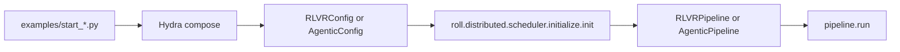
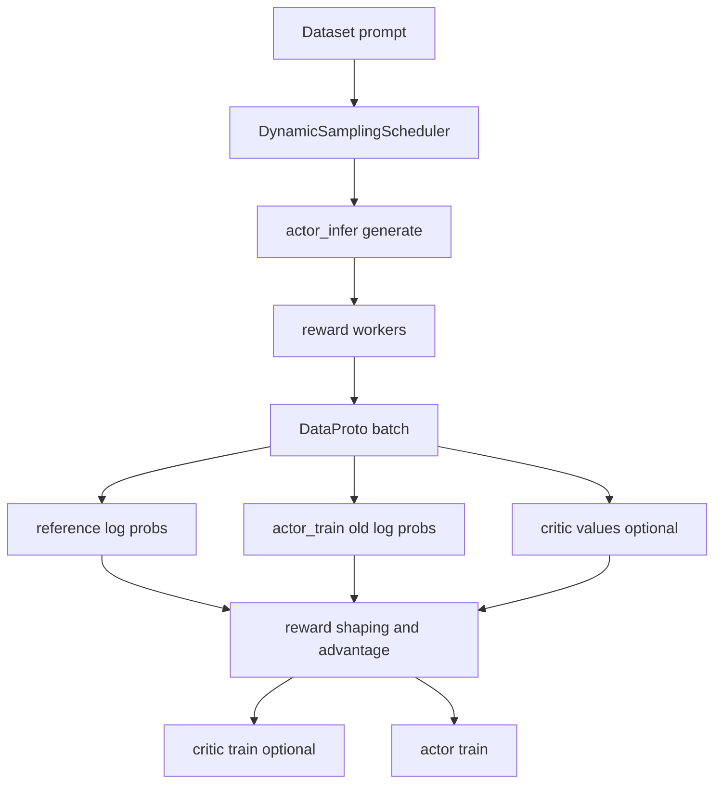
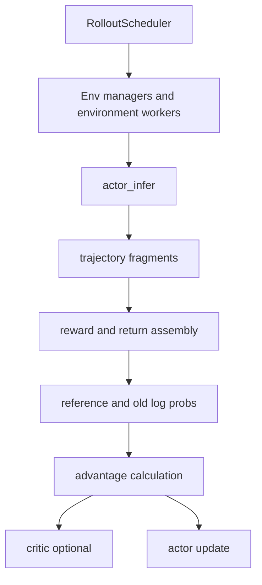

# Quick Start for Reading the ROLL Source Code

This page is for the reader who wants a fast but accurate mental model before diving into implementation details.

## 1. The shortest useful summary

ROLL is a large-scale RL post-training framework for LLMs and VLMs.

It supports at least two major operating modes:

- **RLVR**: collect prompts, generate responses, score them with rule/model rewards, then update the policy.
- **Agentic RL**: let the model interact with environments or tools, collect trajectories, then update the policy.

Both modes reuse the same lower-level runtime ideas:

- Ray-based multi-role deployment
- explicit resource placement
- separate train and infer roles
- pluggable backend strategies
- `DataProto` as the standard batch format

## 2. Start from the entry scripts

The cleanest way to enter the repo is through the top-level launchers.

```bash
python examples/start_rlvr_pipeline.py --config_name sppo_config
python examples/start_agentic_pipeline.py --config_name sokoban_ppo_config
```

Those entry points do the same three things:

1. load Hydra config,
2. materialize a dataclass config object,
3. call `init()` and then `pipeline.run()`.



## 3. The first 6 files to read

If you only read six files, read them in this order:

1. `README.md`
2. `examples/start_rlvr_pipeline.py`
3. `roll/pipeline/rlvr/rlvr_pipeline.py`
4. `roll/pipeline/agentic/agentic_pipeline.py`
5. `roll/distributed/executor/cluster.py`
6. `roll/pipeline/base_worker.py`

Why this order?

- The entry script shows the control plane.
- The pipeline shows the loop.
- The cluster shows how work is placed.
- The worker shows how math hits the model.

## 4. The main directories and what they mean

| Directory | Role |
| --- | --- |
| `roll/pipeline/` | training loop orchestration |
| `roll/distributed/executor/` | Ray actor groups, worker creation, rank metadata |
| `roll/distributed/scheduler/` | rollout, routing, batching, request coordination |
| `roll/distributed/strategy/` | backend abstraction for train/infer engines |
| `roll/models/` | model/tokenizer/provider factories |
| `roll/utils/` | RL math, masking, KL logic, balancing, offload helpers |
| `examples/` | runnable configuration entry points |

## 5. How to trace one RLVR batch

Think of a single batch as a parcel that is assembled, scored, reshaped, and then used for gradient updates.



## 6. How to trace one Agentic batch

Agentic RL is similar, but the source of experience is an environment loop rather than a one-shot prompt.



## 7. A practical reading trick

Do **not** start from backend-specific files like `megatron_strategy.py` unless you already know the pipeline contract.

The architecture becomes much easier once you understand these three invariants first:

- the pipeline owns the global training loop,
- the cluster owns distributed execution,
- the worker/strategy pair owns the actual model-side computation.

## 8. What to read next

- For file order: [`source-reading-roadmap.md`](source-reading-roadmap.md)
- For system structure: [`architecture/overview.md`](architecture/overview.md)
- For formulas: [`math-theory.md`](math-theory.md)
