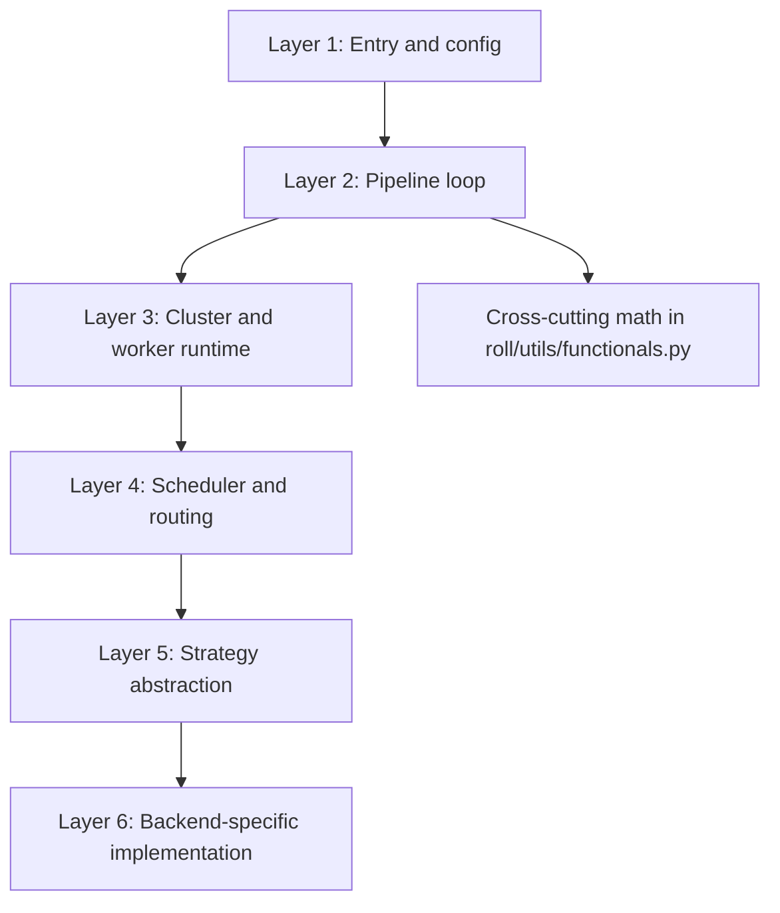
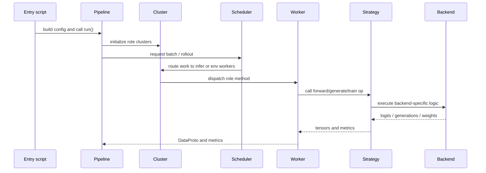

# Source Reading Roadmap

This page is a practical map from common questions to the exact code files that answer them.

## 1. Read by layers, not by filename order

ROLL becomes easier when you read it from outer control logic toward inner execution logic.

## 2. Question-driven reading table

| Question | Best files to open |
| --- | --- |
| How is training launched? | `examples/start_rlvr_pipeline.py`, `examples/start_agentic_pipeline.py` |
| What does a pipeline own? | `roll/pipeline/base_pipeline.py` |
| How does RLVR work? | `roll/pipeline/rlvr/rlvr_pipeline.py`, `roll/pipeline/rlvr/rlvr_config.py` |
| How does Agentic RL work? | `roll/pipeline/agentic/agentic_pipeline.py`, `roll/pipeline/agentic/agentic_config.py` |
| How are workers deployed on resources? | `roll/distributed/scheduler/resource_manager.py`, `roll/distributed/executor/cluster.py` |
| How does a cluster method fan out to multiple ranks? | `roll/distributed/scheduler/decorator.py` |
| What is the common data carrier? | `roll/distributed/scheduler/protocol.py` |
| How are rollout requests scheduled? | `roll/distributed/scheduler/generate_scheduler.py`, `roll/distributed/scheduler/rollout_scheduler.py` |
| How are inference requests routed and paused? | `roll/distributed/scheduler/router.py` |
| Where does PPO loss live? | `roll/pipeline/base_worker.py` |
| Where do reward normalization and advantage logic live? | `roll/utils/functionals.py`, `roll/pipeline/agentic/utils.py` |
| Where are backend differences hidden? | `roll/distributed/strategy/factory.py`, `roll/distributed/strategy/strategy.py` |
| How are NCCL groups offloaded and rebuilt? | `roll/utils/offload_nccl.py` |

## 3. The fastest RLVR reading route

1. `examples/start_rlvr_pipeline.py`
2. `roll/pipeline/rlvr/rlvr_config.py`
3. `roll/pipeline/rlvr/rlvr_pipeline.py`
4. `roll/pipeline/base_pipeline.py`
5. `roll/distributed/executor/cluster.py`
6. `roll/pipeline/base_worker.py`
7. `roll/utils/functionals.py`
8. `roll/distributed/strategy/factory.py`

Why this route works:

- you first understand the training loop,
- then how it allocates roles,
- then how it computes loss,
- then how a backend fulfills the contract.

## 4. The fastest Agentic reading route

1. `examples/start_agentic_pipeline.py`
2. `roll/pipeline/agentic/agentic_config.py`
3. `roll/pipeline/agentic/agentic_pipeline.py`
4. `roll/distributed/scheduler/rollout_scheduler.py`
5. `roll/distributed/scheduler/router.py`
6. `roll/pipeline/agentic/utils.py`
7. `roll/pipeline/base_worker.py`

## 5. Read one vertical slice end to end

If you prefer a vertical slice rather than a layer-by-layer read, trace the following chain:

## 6. A good stopping rule

Stop descending into lower layers once you can answer these three questions in your own words:

- What decides *when* a batch is collected and trained?
- What decides *where* a role runs in the cluster?
- What decides *how* a model backend executes the requested operation?

Once those are clear, backend-specific files become much less intimidating.

## 7. What not to do

Avoid reading the repo in this order:

- random `grep` hits across every backend,
- then partial snippets of reward workers,
- then back to configs.

That path feels busy, but it destroys the architecture picture.

## 8. Next stops

- System skeleton: [`architecture/overview.md`](architecture/overview.md)
- Dispatch and `DataProto`: [`architecture/dispatch-dataflow.md`](architecture/dispatch-dataflow.md)
- Math and intuition: [`math-theory.md`](math-theory.md)
