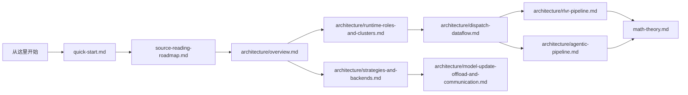

# ROLL 深潜教程：面向源码的保姆级学习路径

如果官方 `README.md` 更像是在回答 **“ROLL 能做什么”**，那么这一套中文教程更像是在回答 **“ROLL 到底是怎么做出来的”**。

这套文档写给真正要读源码的人：系统架构师、RL 研究者、推理/训练基础设施工程师，以及一切想看懂 Ray 调度、异构后端、奖励计算与 PPO 更新链路是如何拼起来的人。

## 为什么 ROLL 值得深读

ROLL 不是一个“加点 PPO 逻辑的训练脚本”。它更像一个面向大模型 RL 的分布式操作系统，要同时处理好几类棘手问题：

- 训练和生成往往想用 **完全不同的后端**。
- 奖励既可能来自 **规则**，也可能来自 **模型**，还可能来自 **环境交互**。
- 大集群里最怕 GPU 在 rollout、reward、模型同步这些阶段空转烧钱。
- Agentic RL 的轨迹又长又不规整，会同时冲击调度和显存。

ROLL 给出的答案是一个分层设计：`Pipeline -> Cluster -> Worker -> Strategy -> Backend`。

## 推荐阅读顺序

| 如果你的问题是…… | 先看哪一页 |
| --- | --- |
| “我想 15 分钟建立全局直觉” | [`quick-start.md`](quick-start.md) |
| “到底哪些源码文件最关键？” | [`source-reading-roadmap.md`](source-reading-roadmap.md) |
| “宏观架构骨架是什么？” | [`architecture/overview.md`](architecture/overview.md) |
| “运行时角色是怎么落到 GPU 和 Ray Actor 上的？” | [`architecture/runtime-roles-and-clusters.md`](architecture/runtime-roles-and-clusters.md) |
| “一个 batch 是怎么在系统里流动的？” | [`architecture/dispatch-dataflow.md`](architecture/dispatch-dataflow.md) |
| “RLVR 是怎么从头跑通的？” | [`architecture/rlvr-pipeline.md`](architecture/rlvr-pipeline.md) |
| “Agentic RL 和 RLVR 的根本区别是什么？” | [`architecture/agentic-pipeline.md`](architecture/agentic-pipeline.md) |
| “Megatron、DeepSpeed、vLLM、SGLang 是怎么接到一起的？” | [`architecture/strategies-and-backends.md`](architecture/strategies-and-backends.md) |
| “KL、PPO clip、GAE、token reward、batch balancing 到底怎么理解？” | [`math-theory.md`](math-theory.md) |
| “模型同步、offload、NCCL 组重建、partial GPU 路由是怎么做的？” | [`architecture/model-update-offload-and-communication.md`](architecture/model-update-offload-and-communication.md) |

## 这套教程锚定的核心源码文件

- `examples/start_rlvr_pipeline.py`
- `examples/start_agentic_pipeline.py`
- `roll/pipeline/base_pipeline.py`
- `roll/pipeline/base_worker.py`
- `roll/pipeline/rlvr/rlvr_pipeline.py`
- `roll/pipeline/agentic/agentic_pipeline.py`
- `roll/distributed/executor/cluster.py`
- `roll/distributed/executor/worker.py`
- `roll/distributed/scheduler/decorator.py`
- `roll/distributed/scheduler/protocol.py`
- `roll/distributed/scheduler/generate_scheduler.py`
- `roll/distributed/scheduler/rollout_scheduler.py`
- `roll/distributed/scheduler/router.py`
- `roll/distributed/strategy/factory.py`
- `roll/distributed/strategy/strategy.py`
- `roll/utils/functionals.py`
- `roll/utils/kl_controller.py`
- `roll/utils/offload_nccl.py`

## 一句话心智模型

**可以把 ROLL 看成一个由 Ray 编排的大模型 RL 运行时系统：Pipeline 决定训练节奏，Cluster 管资源和角色部署，Worker 执行具体职责，Strategy 屏蔽后端差异，而 `DataProto` 则是贯穿全系统的数据货箱。**
