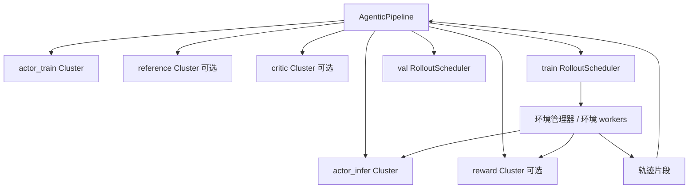
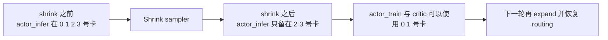

# Agentic Pipeline 深潜解析

Agentic RL 是 ROLL 真正从“单次回答生成器”迈向“可持续交互策略体”的地方。

主要锚点源码：

- `roll/pipeline/agentic/agentic_pipeline.py`
- `roll/pipeline/agentic/agentic_config.py`
- `roll/distributed/scheduler/rollout_scheduler.py`
- `roll/distributed/scheduler/router.py`
- `roll/pipeline/agentic/utils.py`

## 1. 它和 RLVR 的本质跳变在哪？

RLVR 问的是：

“这次回答对不对？”

Agentic RL 问的是：

“这个策略在多轮交互中，整条轨迹上的行为到底好不好？”

这个问题一变，调度难度会瞬间上一个台阶。

## 2. 宏观架构图

## 3. 为什么这里的 scheduler 比 RLVR 更难？

在 RLVR 里，一个 prompt 通常对应一组 response。

但在 Agentic RL 里，一次 rollout 可能涉及：

- 多轮交互
- 多个环境实例
- 部分完成
- 冗余 group
- 异步窗口
- 卡死或超慢环境

也正因为如此，`rollout_scheduler.py` 里会出现这些对象：

- `GroupQueue`
- `GroupQueueManager`
- `EnvActivityMonitor`

## 4. 按阶段来读训练主循环

`agentic_pipeline.py` 里的主循环其实写得很清楚，几乎可以按 phase 背下来。

### Phase 1：先 offload 训练侧状态

训练侧模型会先把状态 offload 出去，为后面的 rollout 相关阶段腾出空间。

### Phase 2：暂停 rollout scheduler，必要时停服务

这样可以防止新请求和模型同步发生竞争。

### Phase 3：执行模型同步

actor_train 的权重会被推到 actor_infer。

### Phase 4：重新加载 actor infer 与 reward 状态

这样 serving 侧又重新具备可用状态。

### Phase 5：在 partial GPU mode 下扩张 sampler

如果上一轮为了给训练腾卡而做过 shrink，这一步就把 routing 状态恢复回来。

### Phase 6：如果需要，异步跑验证

验证任务可以通过线程池并行提交。

### Phase 7：获取 rollout batch

`train_rollout_scheduler.get_batch(...)` 负责真正收集轨迹。

### Phase 8：按需要暂停或停止 serving 侧

为下一个训练阶段清场。

### Phase 9：在 partial GPU mode 下 shrink sampler

这一步会把一部分推理 worker 从训练所需 GPU 上挪走，给训练阶段让路。

## 5. partial GPU mode 为什么很高级？

这是整个仓库里很有“系统工程味”的设计之一。

它的目标很简单：

- rollout 需要推理服务的时候，让推理继续活着；
- 训练开始的时候，不要让 infer 占着训练最需要的 GPU 不放。

### 厨房灶台类比

想象一家餐厅后厨有四个灶。

中午高峰时四个灶都拿来做现炒；到了备菜阶段，其实两个灶就够应付前台了，另外两个灶就能腾出来熬高汤、批量备料。

partial GPU mode 做的，本质上就是这件事，只不过对象从灶台换成了 GPU。

## 6. 为什么 `RouterManager` 是关键角色？

`RouterManager` 就像推理请求世界里的交通警察。

它可以：

- 按 prompt affinity 或 env affinity 路由请求；
- 暂停新流量进入；
- 等 inflight 请求自然清空；
- shrink / expand 活跃 worker。

如果没有这一层控制面，在模型同步前后，agentic rollout 很容易出现语义混乱或状态不一致。

## 7. 环境监控绝不是装饰品

`EnvActivityMonitor` 会记录 episode 的开始时间和提交时间，再检测是否存在 hung env。

这非常重要，因为长生命周期环境一旦卡住，很可能不会立刻报错，但会悄悄拖死整个训练吞吐。

大规模训练里，**可观测性本身就是正确性的一部分**。

## 8. 这里的数学与 RLVR 有什么不同？

policy-gradient 的主心骨仍然像 PPO，但 reward / return 的那一侧会更偏向轨迹级、片段级处理。

在 `agentic/utils.py` 里，ROLL 支持 segmented return，也就是只对某些有意义的 action spans 计算折扣回报，而不是把整条 token 流都当成同一种东西处理。

这很关键，因为 agent trace 里的每个 token 并不都等价。

## 9. 为什么 Agentic RL 的难点远不止“多轮生成”？

真正难的部分不是“让模型多说几轮”，而是同时协调：

- serving
- 环境执行
- reward 访问
- 验证
- 模型同步
- GPU 复用
- 卡死检测

AgenticPipeline 的价值就在于：它把这些本来会散落成一地 callback 的复杂性，收编成了一个一等运行时系统。

## 10. 最简单的一层直觉

RLVR 更像是在批改试卷。

Agentic RL 更像是在比赛中训练球员：每一步动作都会改变后续局面，所以你不能只看最后一脚射门，而必须看整段对局轨迹。

所以它需要的是 scheduler，不只是 scorer。

## 11. 下一站

- 看角色与资源布局：[`runtime-roles-and-clusters.md`](runtime-roles-and-clusters.md)
- 看公式与 segmented return：[`../math-theory.md`](../math-theory.md)
- 看路由与显存复用：[`model-update-offload-and-communication.md`](model-update-offload-and-communication.md)
