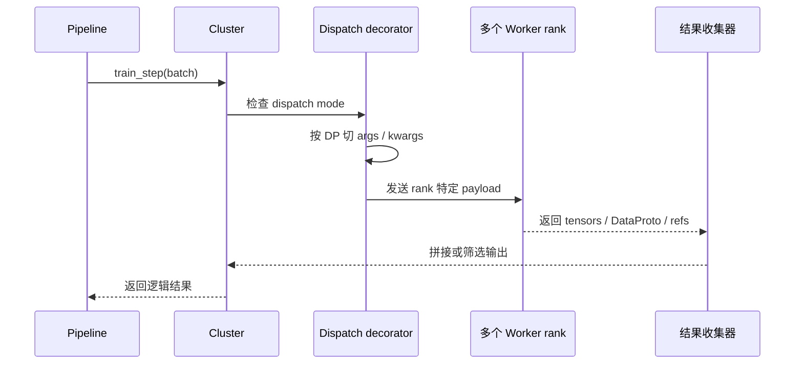
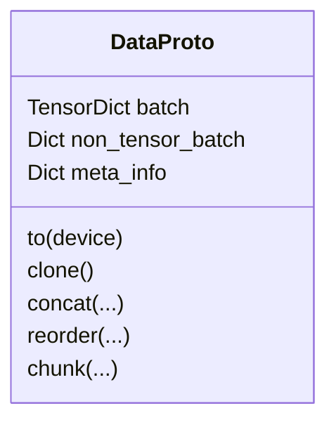

# 分发机制、数据流与 `DataProto`

这一页解释 ROLL 里最优雅、也最容易被低估的一层：

从外面看，你可能只写了一句 `actor_train.train_step(batch)`；
但内部其实发生了数据切分、跨 rank 分发、结果筛选、再拼回来的整个过程。

主要锚点源码：

- `roll/distributed/scheduler/decorator.py`
- `roll/distributed/scheduler/protocol.py`
- `roll/distributed/executor/cluster.py`
- `roll/utils/functionals.py`

## 1. 为什么需要 decorator 这一层？

Pipeline 很想说一句简单的话：

```python
actor_train.train_step(batch)
```

但在真实分布式执行里，这一句背后往往要同时完成：

- 按 DP 维度切 batch；
- 把切片送到多个 worker；
- 避免在非主 TP/CP/PP rank 上重复发送完整 payload；
- 只从“真正有意义”的 rank 收回结果；
- 在需要时把结果重新拼回一个 `DataProto`。

decorator 层的意义，就是把这套复杂性隐藏起来，但又不把语义搞假。

## 2. 分发模式一览

| 分发模式 | 含义 |
| --- | --- |
| `ONE_TO_ALL` | 同一份输入广播到所有 worker |
| `ALL_TO_ALL` | 调用方显式提供“每个 worker 一份输入” |
| `DP_MP_COMPUTE` | 先按 DP 切分，再在模型并行 rank 内扩散 |
| `DP_MP_DISPATCH_FIRST` | 同上，但只让每个 MP 子组的首个 rank 收到完整 payload |

最重要的收集规则在 `collect_dp_mp_compute()` 里：

只有 `tp_rank == 0`、`cp_rank == 0` 且处于 pipeline 最后一级的输出，才会被当成“代表性结果”收回来。

## 3. 一次被装饰方法调用的真实过程



## 4. 为什么 `DP_MP_DISPATCH_FIRST` 很聪明？

假设一个模型配置是 `DP=2`、`TP=2`。

这意味着每个 DP shard 里，还有 2 个 TP rank。

如果你傻乎乎地把完整 `DataProto` 发给每个 TP rank，就会造成：

- 内存冗余
- 运输冗余
- 没必要的 payload 复制

`DP_MP_DISPATCH_FIRST` 的想法是：

- 每个 DP 子组里，只有第一个 MP rank 拿到完整 payload；
- 其他 MP rank 如果可能，只拿 metadata 占位。

这会明显减轻通信和内存压力，但又不破坏控制语义。

## 5. `DataProto` 就是系统里的标准货箱

`DataProto` 有三个主要舱位：

| 字段 | 含义 |
| --- | --- |
| `batch` | 真正的张量数据，内部是 `TensorDict` |
| `non_tensor_batch` | UUID、tag、domain、traj_id 等对象数组 |
| `meta_info` | metrics、generation config、mask、控制标记等运行时信息 |



## 6. 为什么 `DataProto` 重要得离谱？

如果没有统一数据容器，每一层边界都得写一堆定制胶水代码。

但有了 `DataProto`，scheduler、worker、strategy 之间就可以统一交换一个对象，哪怕里面同时装着：

- token 张量
- domain 标签
- reward metrics
- request IDs
- rollout bookkeeping

这会极大降低系统复杂度。

## 7. 一个很小的 DP 切分例子

假设一个 batch 有 8 个样本，`DP=2`。

那 `_split_args_kwargs()` 会把它切成两个 4 样本子块：

- DP rank 0 拿样本 `0-3`
- DP rank 1 拿样本 `4-7`

如果每个 DP shard 里还带 TP rank，那么 decorator 再决定在 shard 内部怎么复制和怎么收集。

## 8. padding / unpadding 不是边角细节

`pad_dataproto_to_divisor()` 和 `unpad_dataproto()` 的存在，是因为很多并行路径都更喜欢“batch 大小能整除某个 world size”。

翻译成人话：

有时候系统会先临时塞几个“假箱子”，让每辆车都装一样多的货，运完之后再把这些假箱子扔掉。

## 9. 为什么 batch balancing 也属于数据流的一部分？

`batch_balance()` 会重排样本，让每个 DP 分区拿到相近的预计工作量。

这不只是“公平”问题，而是“减少等待”问题。

如果一个 DP rank 全拿到了超长序列，别的 rank 很快做完后就只能傻等。

## 10. 最深的一层直觉

分发层本质上是 **逻辑意图** 和 **物理执行** 之间的翻译器。

Pipeline 说的是：

“拿这个 batch 去训练。”

decorator 系统翻译成的是：

“哪些 rank 需要拿哪一部分？哪些 rank 的输出才算数？”

正是这层翻译器的存在，才让其他层代码还能保持相对优雅。

## 11. 下一站

- 看 RLVR 流程：[`rlvr-pipeline.md`](rlvr-pipeline.md)
- 看 Agentic 流程：[`agentic-pipeline.md`](agentic-pipeline.md)
- 看后端契约：[`strategies-and-backends.md`](strategies-and-backends.md)
