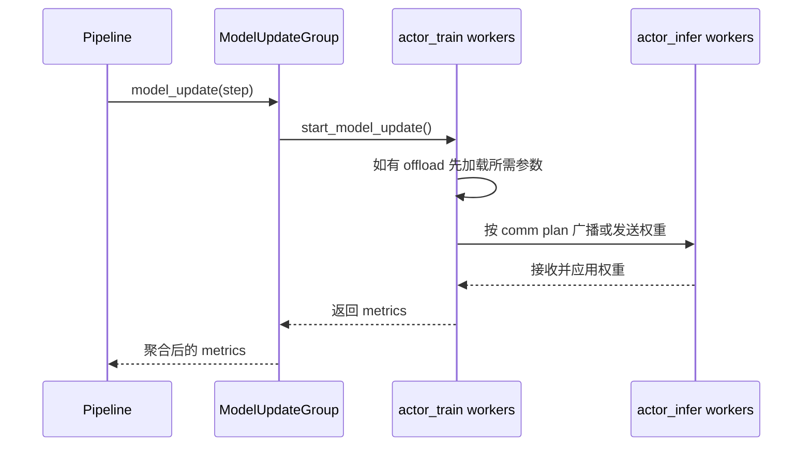
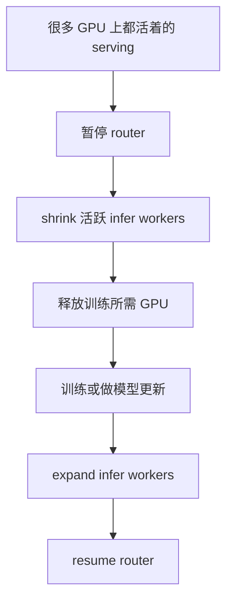

# 模型同步、Offload 与通信机制

这一页专门解释 ROLL 是怎么搬运权重、暂停推理流量、回收显存、再把通信状态安全恢复回来的。

主要锚点源码：

- `roll/distributed/executor/model_update_group.py`
- `roll/distributed/executor/worker.py`
- `roll/distributed/strategy/strategy.py`
- `roll/distributed/scheduler/router.py`
- `roll/utils/offload_nccl.py`
- `roll/distributed/scheduler/resource_manager.py`

## 1. 大规模训练真正卡的地方是什么？

在大规模 RL 训练里，最贵的部分往往不只是公式本身，而是公式周围那一圈系统协调成本：

- 把新策略权重推到 serving workers
- 在正确时机暂停请求流量
- 临时释放 GPU 显存
- 安全地重建通信状态

ROLL 把这些东西都做成了显式机制，而不是“碰运气”。

## 2. 模型同步链路长什么样？

`ModelUpdateGroup` 会把一个 source cluster 和一个 target cluster 绑成一对，最常见的就是：

`actor_train -> actor_infer`

## 3. 为什么通信组要预先规划？

在 `strategy.py` 里，collective groups 是根据 communication plan 建起来的。

Strategy 会决定：

- 谁是 sender
- 谁是 receiver
- group_name、master_addr、master_port 用什么
- 总共有多少 rank 参与

这件事的本质是：模型同步不是简单粗暴 `state_dict` 一拷贝，而是一个真正的分布式运输问题。

## 4. Worker 侧的 offload 生命周期

`Worker` 基类暴露了三组非常关键的操作：

- `load_states()`
- `offload_states()`
- `start_model_update()`

这背后的核心思路很简单：

- 某个角色这阶段不用时，就把状态挪走；
- 下一阶段它重新需要时，再只加载必要部分。

这给 pipeline 提供了一个非常强的杠杆：用时间换显存。

## 5. Reloadable NCCL groups：这招非常细但非常强

`offload_nccl.py` 会 monkey patch `torch.distributed.new_group()`，让 NCCL groups 变成 `ReloadableProcessGroup`。

这有什么价值？

因为这样系统就能：

- 销毁 process groups 以释放资源；
- 之后再按同样 rank 集合把它们重建回来。

这是很少见但很有威力的系统技巧，尤其适合那些阶段切换频繁、通信组又很占资源的 workflow。

## 6. Router 的 suspend / resume 不是便利功能，而是正确性保障

`RouterManager` 能做这些事：

- 暂停新请求进入
- 中止已有请求
- 等 inflight 请求自然清空
- 在 serving 侧恢复一致状态后再 resume

如果没有这层保障，系统很容易在某个逻辑 step 里混入“旧权重生成的数据”和“新权重生成的数据”。

从训练语义上说，这是很危险的。

## 7. Partial GPU manager：把 serving GPU 重新抢回来

`router.py` 里的 `PartialGPUManager` 会把目标 GPU ID 映射成 DP rank，然后执行 shrink / expand。

这在 Agentic RL 尤其重要，因为：

- rollout 阶段需要推理服务
- 训练阶段又想回收部分推理卡
- 两边既重叠又不完全重叠

## 8. 用“水箱搬水”来理解它

可以把模型参数想成水，把 GPU 想成水箱。

- 训练阶段，最新的水先灌进 train 侧水箱；
- 模型同步时，再把水通过管道输送到 infer 侧水箱；
- offload 就像把暂时不用的水抽去便宜仓库；
- router suspend 则像在改管道前先关掉所有住户的水龙头。

如果不先关水龙头，用户得到的就会是“新旧水混着来的半截状态”。

## 9. 为什么这里还离不开 `ResourceManager`？

通信和 offload 从来都不是抽象概念，它们强依赖“rank 到底落在哪些设备上”。

`ResourceManager` 之所以关键，就是因为它让系统知道：

- 哪些 GPU 属于哪个 node
- 哪组 device IDs 组成了一个 worker
- 一个全局 GPU ID 该怎么还原成 `node_rank + gpu_rank`

也正因为如此，partial GPU routing 才能用“全局 GPU 编号”来表达意图，并且真正落到正确设备上。

## 10. 常见瓶颈与 ROLL 的对应招数

| 瓶颈 | ROLL 机制 |
| --- | --- |
| infer 服务还在用旧权重 | `ModelUpdateGroup` + strategy comm plan |
| inflight 请求跨 step 混线 | `RouterManager.suspend()` + `wait_complete()` |
| 不活跃角色仍然吃显存 | `offload_states()` + `load_states()` |
| phase 切换后 process group 还占资源 | `ReloadableProcessGroup` |
| train 与 infer 抢同一批 GPU | partial-GPU shrink / expand |

## 11. 最后的大结论

很多框架讲完优化公式就结束了。

但 ROLL 更进一步：它把 **权重搬运、显存生命周期、请求路由** 这些东西也视作 RL 训练的一等组成部分。

所以它给人的感觉，已经不只是“一个 trainer”，而更像是“分布式 serving 系统 + 优化器系统”的拼装体。
