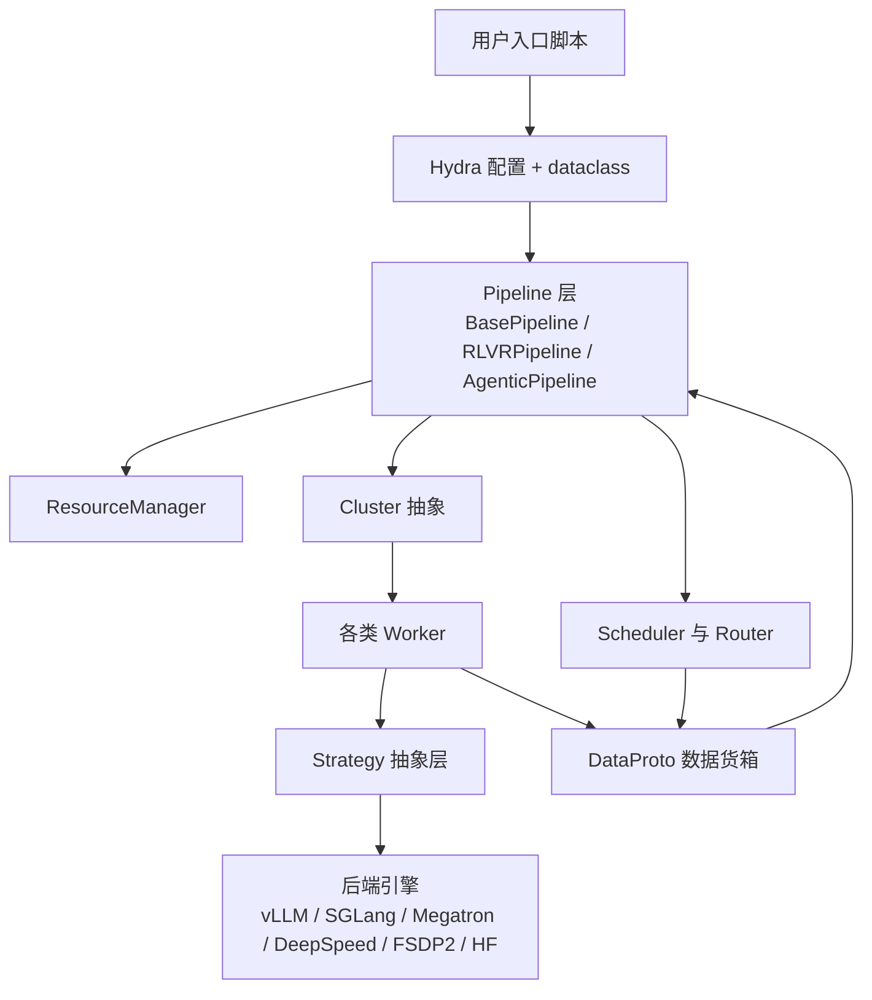
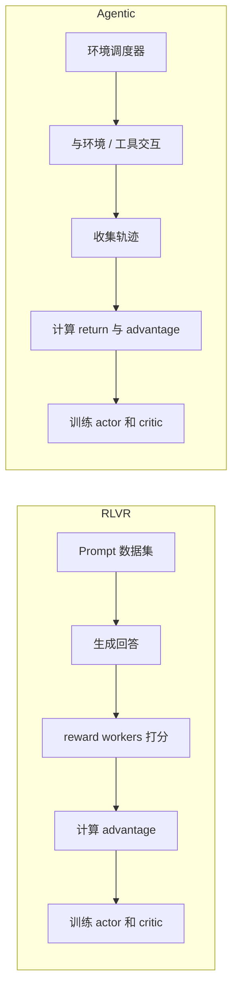

# 架构总览

想真正看懂 ROLL，最重要的一步是：不要再把它想成一个“单体 PPO trainer”，而要把它看成一个 **面向大模型 RL 后训练的分布式控制系统**。

## 1. ROLL 真正在解决什么行业级问题？

大模型 RL 训练之所以难，是因为它同时踩中了三类复杂性：

- 策略模型既要 **训练**，又要 **生成**；
- 奖励链路可能是异构的、动态的；
- 集群必须在长 rollout、权重同步、显存压力下仍然保持高利用率。

一个天真的方案，会把所有逻辑塞进一个超级大进程里。ROLL 反其道而行之：它把系统拆成角色，让每个角色用最适合它的引擎做事。

## 2. 宏观骨架图

## 3. 五个最关键的架构思想

### 3.1 Pipeline 负责“时间”

Pipeline 决定每个训练 step 的阶段顺序：

- rollout / generation
- reward 或环境交互
- reference 和 old log-prob 计算
- advantage 构造
- actor / critic 更新
- checkpoint 与 logging

### 3.2 Cluster 负责“摆放”

`Cluster` 负责把一个逻辑角色映射成一组 Ray actors，并知道这些 actors 分别落在哪些 rank、哪些节点、哪些 GPU 上。

### 3.3 Worker 负责“角色语义”

Worker 不只是一个进程，而是一个带职责的角色，比如 actor、infer server、critic、reward worker、environment worker。

### 3.4 Strategy 负责“屏蔽后端差异”

Worker 说的是高层操作，比如 `generate`、`forward_step`、`setup_model_update`；Strategy 则决定这些操作如何用 vLLM、SGLang、Megatron、DeepSpeed、FSDP2 等后端去实现。

### 3.5 `DataProto` 负责“运输”

`DataProto` 是系统统一的数据货箱，用来在 scheduler、cluster、worker、strategy 之间搬运张量数据、非张量元数据和运行时注释信息。

## 4. 两条大流水线，共用同一套运行时哲学

两条链路业务形态不同，但共享同一套设计词汇：

- 角色化集群
- 后端抽象
- 显式调度
- 统一 batch 协议
- 可配置的 reward / advantage 逻辑

## 5. 为什么这种分层设计特别强？

因为它允许 ROLL 在不改整体骨架的前提下，把不同引擎拼成一个系统。

例如：

- actor 训练可以用 Megatron 或 DeepSpeed；
- actor 推理可以用 vLLM 或 SGLang；
- reward 可以来自规则、reference，或者单独的 infer 集群；
- agentic rollout 还能用和 RLVR 完全不同的 scheduler。

这就是 ROLL 能从小规模单机一路长到大规模集群，却不需要推翻重写的根本原因。

## 6. 一个生活类比

你可以把它想成一部电影制作系统：

- **pipeline** 是拍摄计划表；
- **cluster** 是各个剧组部门；
- **worker** 是演员、摄像组、剪辑组；
- **strategy** 是每个部门手上的专业工具；
- `DataProto` 则是各部门之间传素材的标准箱子。

一部电影拍得成，不是因为所有人都用同一种工具，而是因为所有人都遵守同一份协作契约。

## 7. 下一站

- 看角色与资源摆放：[`runtime-roles-and-clusters.md`](runtime-roles-and-clusters.md)
- 看分发与 `DataProto`：[`dispatch-dataflow.md`](dispatch-dataflow.md)
- 看具体主流程：[`rlvr-pipeline.md`](rlvr-pipeline.md) 与 [`agentic-pipeline.md`](agentic-pipeline.md)
