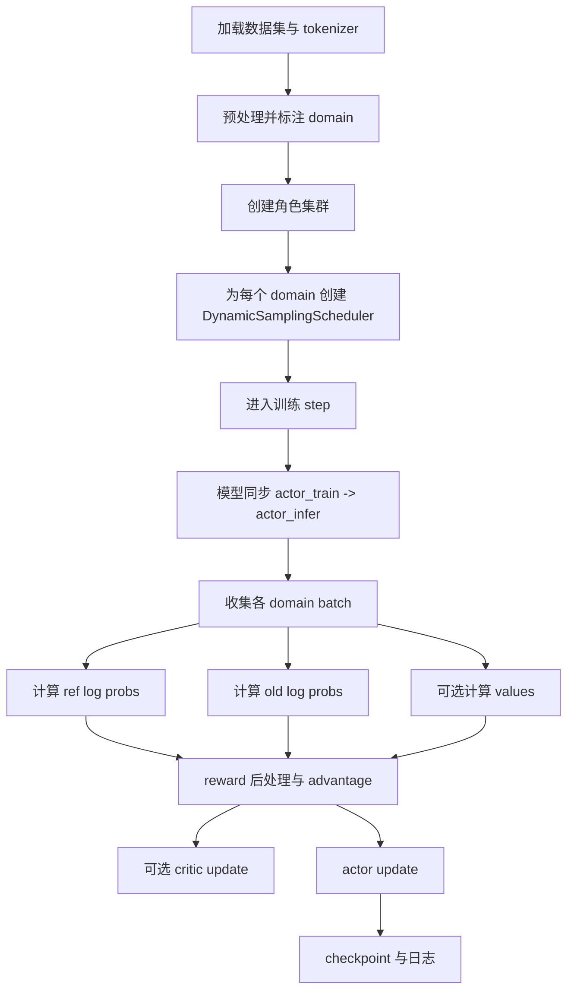

# RLVR Pipeline 深潜解析

RLVR 是 **Reinforcement Learning with Verifiable Rewards** 的缩写。放到 ROLL 里，它代表的是这样一条训练路径：

只要系统能用规则、可执行校验、reward model，或者 LLM-as-judge 的方式判断模型输出，那这条路径就能工作。

主要锚点源码：

- `roll/pipeline/rlvr/rlvr_pipeline.py`
- `roll/pipeline/rlvr/rlvr_config.py`
- `roll/pipeline/base_pipeline.py`
- `roll/pipeline/base_worker.py`
- `roll/distributed/scheduler/generate_scheduler.py`
- `roll/utils/functionals.py`

## 1. 一句话故事版

RLVRPipeline 会先加载并预处理数据集，再按 domain 切分数据，创建各类角色集群，为每个 domain 建一个动态生成调度器，收集 rollout，计算 reward 和 advantage，最后更新 actor 与可选的 critic。

## 2. 为什么 domain 在这里是一等公民？

ROLL 从一开始就不假设“所有 prompt 都是同一种任务”。

一个训练任务里可以同时保留多种 domain 数据，例如：

- math
- code
- reasoning
- instruction following

并且每个 domain 都可以有自己的：

- reward worker
- 采样比例
- 单 step 内 batch 份额

## 3. 宏观流程图

## 4. 初始化阶段都干了什么？

### 4.1 先处理数据集与 prompt 编码

`preprocess_dataset()` 负责模板化、tokenize，以及 prompt 长度过滤。

### 4.2 构建 domain 视图

当 tag 被映射成 domain 后，pipeline 会通过过滤主数据集，构建 `self.domain_datasets[domain]`。

这一步的意义是：不同 domain 后续可以独立调度，而不是全都挤在一个混合池子里。

### 4.3 构建角色集群

典型角色包括：

- `actor_train`
- `actor_infer`
- `reference`（如果启用 reference KL）
- `critic`（如果 `adv_estimator == "gae"`）
- 按 domain 划分的 reward clusters
- 可选共享 `reward_model_cluster`

### 4.4 构建生成调度器

每个 domain 都会配一个 `DynamicSamplingScheduler`。它知道：

- 从哪个数据集采样；
- 该调用哪个 infer cluster；
- 该和哪个 reward cluster 配合；
- 这一轮 step 需要凑够多少样本。

## 5. domain batch 分配的小例子

假设：

- `rollout_batch_size = 8`
- `domain_interleave_probs = {math: 0.75, code: 0.25}`

那么一轮 step 会大致分成：

- math 拿 6 个 prompt
- code 拿 2 个 prompt

这看起来简单，但它背后的意义很大：ROLL 在做的是“多 domain 强化学习联合训练”，而不是把所有任务粗暴揉成一个数据桶。

## 6. 一个训练 step 里真正发生了什么？

### Step 1：先把 train 权重同步到 infer

`self.model_update(global_step)` 会通过 `ModelUpdateGroup` 把 actor_train 的最新权重推到 actor_infer。

这样 rollout 生成出来的数据，才能真正反映当前策略的行为。

### Step 2：收集 rollout 数据

每个 domain scheduler 各自产出一个 batch，最后用 `DataProto.concat(...)` 合并成一个整体训练 batch。

### Step 3：计算概率与 value

在合并后的 batch 上，pipeline 可能会继续计算：

- reference log probs
- old actor log probs
- critic values

从这一刻开始，rollout 才真正变成“可用于更新的训练材料”。

### Step 4：reward shaping 与 advantage

对每个 domain 分组，ROLL 会依次做经典四连：

- sample-level mask
- reward normalization 与 clipping
- token reward 构造 + KL shaping
- advantage 计算

### Step 5：训练模型

- 如果启用了 GAE，就先更新 critic
- actor 则在可选的 critic warmup 之后开始更新

### Step 6：记录日志与保存 checkpoint

metrics、scheduler state、RNG state、checkpoint 都会在这一步完成记录。

## 7. 为什么 reward 要按 domain 分组处理？

这是 RLVRPipeline 里一个非常漂亮的工程选择。

不同任务族的 reward 分布天然就不一样。

- 代码执行奖励
- 数学 boxed-answer 奖励
- LLM-as-judge 奖励

这些东西如果混在一起做统一统计，非常容易互相污染。按 domain 分组的本质，就是让每种任务保留自己的 reward 统计语境。

## 8. `DynamicSamplingScheduler` 本质上在干什么？

它不只是一个队列，而更像一个“流量控制器”。

它决定：

- 什么时候还能继续发新 prompt；
- 异步窗口如何管理；
- 已完成样本如何分组回收；
- 凑够多少样本才能让 pipeline 继续往下走。

也就是说，它连接了“数据集迭代”和“生成延迟高度不规则”之间的鸿沟。

## 9. 为什么 RLVR 天然对系统更友好？

与完全主观的 RLHF 环路相比，RLVR 的奖励路径通常更容易被拆解、并行化、标准化。

这也是为什么 ROLL 可以自然组合：

- rule workers
- code sandbox workers
- reward-model infer clusters
- 标准 actor / reference / critic 路径

## 10. 一个非常形象的生活类比

你可以把 RLVRPipeline 想成一座有多条生产线的工厂。

- 每个 domain 是一条生产线；
- `actor_infer` 负责生产候选结果；
- reward workers 负责质检；
- actor_train 根据质检结果学习如何下次做得更好。

而 pipeline 经理的工作，是保证各条线虽然业务不同，但最后都能汇到同一次更新里。

## 11. 下一站

- 看分发与数据运输：[`dispatch-dataflow.md`](dispatch-dataflow.md)
- 看数学与公式：[`../math-theory.md`](../math-theory.md)
- 看通信与 offload：[`model-update-offload-and-communication.md`](model-update-offload-and-communication.md)
