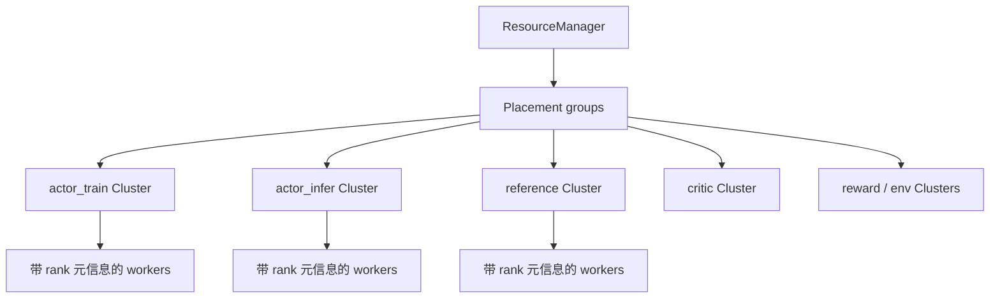
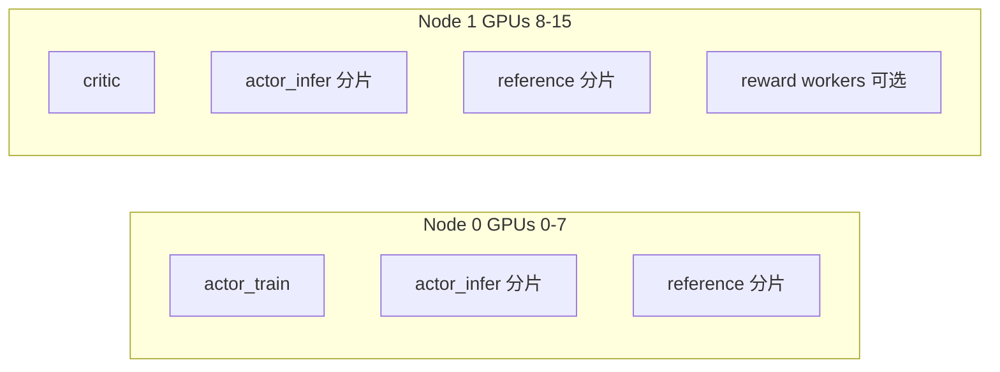

# 运行时角色与集群

这一页专门解释：ROLL 是怎样把抽象角色，最终落成真正跑在 GPU 上的 Ray workers 的。

主要锚点源码：

- `roll/distributed/scheduler/resource_manager.py`
- `roll/distributed/executor/cluster.py`
- `roll/distributed/executor/worker.py`
- `examples/docs_examples/example_ppo.yaml`

## 1. 最核心的想法

在 ROLL 里，`actor_train`、`actor_infer` 这种角色，并不是靠一堆零散 launch 脚本硬拼出来的。

更标准的过程是：

- 从 `WorkerConfig` 出发，
- 构建一个 `Cluster`，
- 再由 `Cluster` 按正确设备映射创建对应的 Ray actors。

## 2. 核心运行时对象

| 对象 | 它负责什么 |
| --- | --- |
| `ResourceManager` | 集群级 placement group 与设备分配 |
| `Cluster` | 一个逻辑角色对应的一组 workers |
| `Worker` | 单个 Ray actor，带 rank 与运行时状态 |
| `RankInfo` | 一个 worker 的 DP/TP/PP/CP 坐标信息 |

## 3. `ResourceManager` 的思维方式

`ResourceManager` 会先去看 Ray 当前有哪些可用资源，然后筛选满足 `num_gpus_per_node` 的节点，为这些节点建立 placement groups，再记录 `node_rank -> placement_group` 的映射。

它最关键的方法是：

`allocate_placement_group(world_size, device_mapping)`

这个方法做的事情，本质上就是把“我想要 8 个 rank，跑在 `[0..7]` 这些 GPU 上”这种逻辑需求，翻译成结构化的设备记录：

- `node_rank`
- `gpu_rank`
- `placement_group`
- `ray_address`

## 4. `Cluster` 是如何把 placement 变成 workers 的

`Cluster._create_workers()` 做了几件很隐蔽但非常关键的事：

- 选择部署 placement group；
- 设置分布式环境变量；
- 记录 visible devices；
- 为每个 rank 创建一个 Ray actor；
- 从 rank0 抓到 `MASTER_ADDR` 和 `MASTER_PORT`。

也正是因为这些动作，`Cluster` 才不是“一堆互相不认识的进程”，而是一个真正有内聚性的分布式角色。

## 5. Worker 命名不是装饰，而是调试利器

Worker 的名字像：

- `actor_train-0-G0`
- `actor_infer-0-G01`

这类命名非常有价值，因为它天然编码了：

- 集群名
- rank
- 当前可见 GPU 集合

当你去看 timeline、日志、性能问题时，这类名字会极大减轻认知负担。

## 6. ROLL 里的主要角色词汇表

| 角色 | 常见职责 |
| --- | --- |
| `actor_train` | 做 forward/backward 并更新策略 |
| `actor_infer` | 负责生成文本或动作 |
| `reference` | 计算 KL 参考 log probabilities |
| `critic` | 预测 value，用于 GAE |
| `reward` / `rewards` | 计算奖励或判断分数 |
| environment workers | 执行环境或工具交互 |

## 7. 一个 16-GPU 配置的直觉图

`examples/docs_examples/example_ppo.yaml` 是一个非常适合教学的案例。

你可以把它理解成类似这样的布局：

- `actor_train` 占用 `0-7` 号 GPU
- `actor_infer` 占用 `0-15` 号 GPU
- `reference` 占用 `0-15` 号 GPU
- `critic` 占用 `8-15` 号 GPU

这意味着：同一个机房里可以有多个逻辑角色重叠存在，但它们仍然通过不同的 cluster 对象和不同生命周期去管理。

## 8. 为什么要把 train 和 infer 分开？

因为训练和推理对引擎的诉求完全不一样。

- 训练更关心 optimizer state、反向传播、ZeRO 或 Megatron 并行；
- 推理更关心高吞吐生成、KV-cache 利用、vLLM / SGLang 这类 serving 引擎。

train / infer 分离的本质，就是让两边都能用各自最擅长的工具。

## 9. `Worker` 是分布式身份真正开始的地方

`Worker` 基类会初始化：

- `RANK`, `WORLD_SIZE`, `LOCAL_RANK`
- `MASTER_ADDR`, `MASTER_PORT`
- shared storage
- `RankInfo`

也就是说，从这一步开始，一个普通进程才真正变成“一个知道自己在整个分布式系统中位置”的运行时单元。

## 10. 一个生活类比

你可以把 `ResourceManager` 想成机场塔台，把 `Cluster` 想成一家航空公司，把每个 `Worker` 想成一架飞机。

- 塔台决定跑道和停机位；
- 航空公司决定机队编组；
- 每架飞机知道自己的航班号和路线。

缺了任何一层，你拥有的都不是“空中交通系统”，而只是“很多昂贵的铁壳子”。

## 11. 下一站

- 看分发机制：[`dispatch-dataflow.md`](dispatch-dataflow.md)
- 看 RLVR 主循环：[`rlvr-pipeline.md`](rlvr-pipeline.md)
- 看通信与 offload：[`model-update-offload-and-communication.md`](model-update-offload-and-communication.md)
