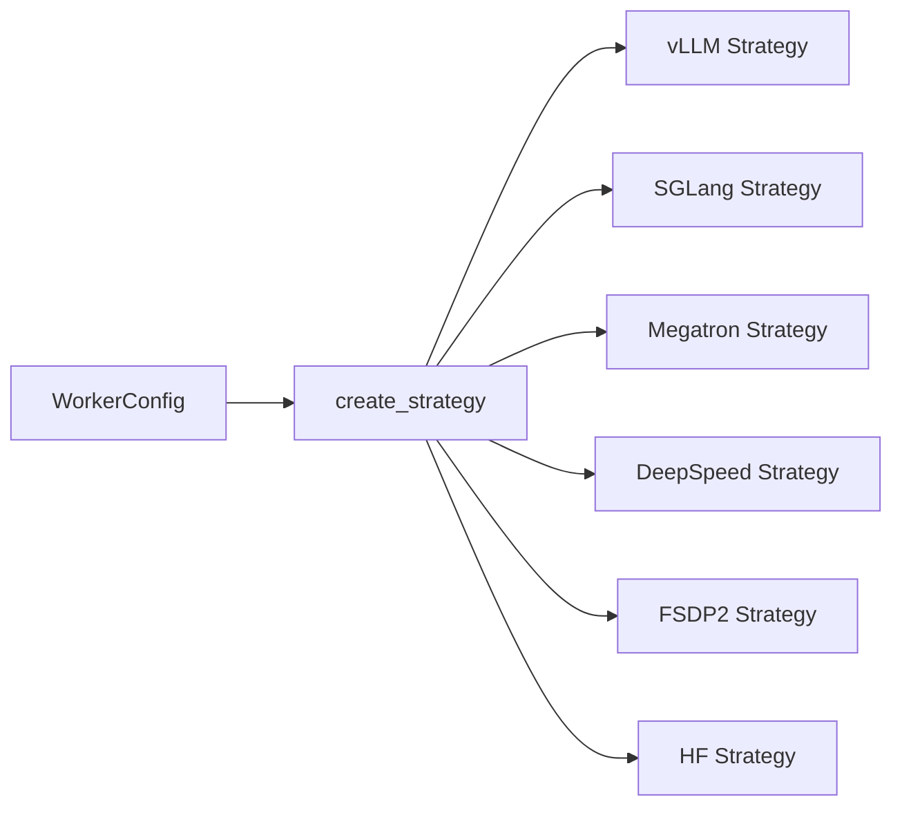

# 策略层与后端

ROLL 在工程上最漂亮的一点之一，就是 Worker 说话时用的是 **strategy 接口语言**，而不是直接绑死某个后端 API。

主要锚点源码：

- `roll/distributed/strategy/factory.py`
- `roll/distributed/strategy/strategy.py`
- `roll/distributed/strategy/vllm_strategy.py`
- `roll/distributed/strategy/sglang_strategy.py`
- `roll/distributed/strategy/megatron_strategy.py`
- `roll/distributed/strategy/deepspeed_strategy.py`
- `roll/distributed/strategy/fsdp2_strategy.py`

## 1. 为什么要有 strategy 这一层？

因为不同角色天然需要不同引擎。

- 训练更偏好 Megatron、DeepSpeed、FSDP2
- 推理更偏好 vLLM、SGLang
- 某些辅助路径则可能用更轻量的 HF infer

如果 Worker 直接依赖后端内部 API，整个代码库很快就会变成一大坨特判。

ROLL 的做法是：

- 从 config 里读出 strategy name
- 通过 `create_strategy(worker)` 选择具体策略类
- 把一个统一接口交给 worker 使用

## 2. 两套契约：推理契约与训练契约

`strategy.py` 里定义了最核心的公共形状。

### InferenceStrategy

它负责的操作包括：

- `initialize`
- `generate`
- `forward_step`
- `load_states`
- `offload_states`
- 模型同步相关 collective group 初始化

### TrainStrategy

它进一步补上训练与参数同步所需的那部分能力，用来服务 actor 和 critic 训练角色。

## 3. 为什么这层抽象不是“代码洁癖”，而是系统优势？

因为它允许一个 pipeline 同时拼接 **异构引擎**。

比如：

- actor 训练用 Megatron
- actor 推理用 vLLM
- reward model 推理再用另一种 infer strategy
- reference 模型还可以用另一种并行切法

这不是“写得优雅一点”这么简单，而是实打实的系统级灵活性。

## 4. 后端速查表

| 后端 | 常见角色 | 擅长什么 |
| --- | --- | --- |
| vLLM | actor infer / reward infer | 高吞吐文本生成、KV-cache 利用好 |
| SGLang | actor infer / 工具型 serving | 快速 serving，路由支持强 |
| Megatron | actor train / reference infer | 大规模张量并行、流水并行训练 |
| DeepSpeed | actor 或 critic train | optimizer sharding、显存效率高 |
| FSDP2 | train 或 infer | 新一代 PyTorch 原生 sharding 路径 |
| HF | 轻量推理 | 更简单的 fallback 或工具型推理 |

## 5. 所有后端都必须遵守哪些公共操作？

strategy 接口暴露了一组 pipeline 到处都要依赖的操作：

- `op_compute_log_probs`
- `op_compute_entropy`
- language loss helper
- 模型同步 collective-group setup
- offload / load 生命周期钩子

这意味着：算法层完全可以说“我要 log probs”，而不用关心底层模型到底是 Megatron 还是 vLLM 系路线。

## 6. 为什么需要 async wrapper？

vLLM 和 SGLang 有时天然更适合 async 风格的 serving 接口。`factory.py` 可以把这些策略包上一层 sync wrapper，这样 Ray 的 threaded actor 就不需要到处手写 event loop 管理逻辑。

这是一个小实现细节，但收益很大：Worker 代码会清爽很多。

## 7. Strategy 是“分布式数学落地成张量计算”的地方

在 `strategy.py` 里，像 `op_compute_log_probs`、`op_compute_various_divergence` 这样的操作，就是把抽象公式真正翻译成模型侧张量操作的地方。

同时，它还负责把：

- sharded logits
- attention masks
- 分布式 vocab gather

这些底层麻烦事，统一包装成 worker 层可调用的接口。

## 8. 如何在脑中选择一个后端？

你只需要问两个问题。

### 问题 1：这个角色主要是在生成，还是主要在训练？

- 主要生成 -> vLLM / SGLang 很有吸引力
- 主要训练 -> Megatron / DeepSpeed / FSDP2 更自然

### 问题 2：当前集群最卡的瓶颈是什么？

- 显存 -> 更偏向 sharding / offload 友好的训练后端
- serving 吞吐 -> 更偏向高性能 infer 引擎
- 复杂并行度 -> 更偏向 Megatron 风格分布式策略

## 9. 一个生活类比

Worker 说的是：

“我需要一辆能把这个货送到的交通工具。”

Strategy 决定的是：

“这辆工具到底是卡车、火车还是货运飞机。”

Pipeline 根本不在乎品牌，它只在乎：承诺的货到底能不能按约送达。

## 10. 下一站

- 看通信与 offload：[`model-update-offload-and-communication.md`](model-update-offload-and-communication.md)
- 看 RLVR 流程：[`rlvr-pipeline.md`](rlvr-pipeline.md)
- 看 Agentic 流程：[`agentic-pipeline.md`](agentic-pipeline.md)
