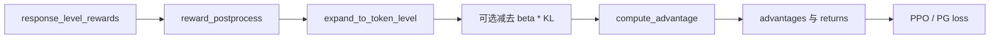

# 数学原理，但尽量讲成人话

这一页专门负责把 ROLL 里的关键公式，从“论文符号”翻译成“源码逻辑 + 生活直觉”。

主要锚点源码：

- `roll/pipeline/base_worker.py`
- `roll/utils/functionals.py`
- `roll/utils/kl_controller.py`
- `roll/pipeline/agentic/utils.py`



## 1. PPO ratio：新策略到底变了多少？

在 `base_worker.py` 里，策略比值写成：

$$
r_t = \exp\big(\log \pi_\theta(a_t\mid s_t) - \log \pi_{old}(a_t\mid s_t)\big)
$$

这些符号到底在说什么？

- $s_t$：当前状态，放到大模型里通常就是当前 token 上下文
- $a_t$：当前动作，对 LLM 来说往往就是当前采样出的 token
- $\pi_\theta$：当前策略
- $\pi_{old}$：产出 rollout 时用的旧策略
- $r_t$：新策略相对旧策略，对同一个动作到底“更偏爱了多少”

### 菜市场版本的小例子

假设卖水果的大妈以前推荐苹果的概率是 `0.20`，现在模型更新后变成了 `0.26`。

那么：

$$
r_t = 0.26 / 0.20 = 1.30
$$

这表示：**新策略对这次决策比旧策略高了 30% 的信心。**

但 PPO 不会让你这么激进地乱跳，它会裁剪：

$$
L_{clip} = -\min(r_t A_t, \text{clip}(r_t, 1-\epsilon, 1+\epsilon) A_t)
$$

代码里对应的就是 `surr1`、`surr2` 和 `torch.min(...)`。

如果 `pg_clip = 0.2`，允许的比值区间就是 `[0.8, 1.2]`。也就是说，哪怕你真的算出来 `1.30`，PPO 也会把它当成 `1.20` 来看，防止训练一下子冲太猛。

## 2. 为什么 ROLL 里 KL 会出现两次？

在 ROLL 里，KL 不是只干一件事。

### 2.1 KL 作为 reward shaping 惩罚项

在 `compute_token_reward()` 或 `apply_kl_penalty()` 里，token reward 会被改写为：

$$
r^{token}_t \leftarrow r^{token}_t - \beta \cdot KL_t
$$

直觉上就是：

“如果你虽然拿到了高奖励，但方法是离参考模型漂得太远，那我要对你额外收税。”

### 2.2 KL 作为训练监控量或 loss 组成部分

在 `base_worker.py` 的 actor loss 里，还会计算近似 KL，一部分用来观察当前策略相对 reference 的偏移，一部分用来观察相对 old policy 的步长大小。

前者更像“别跑偏太远”，后者更像“别走太大步”。

## 3. approximate KL：源码实际上在算什么

`compute_approx_kl()` 支持好几种形式。

最直观的一种可以写成：

$$
KL_{approx} \approx \log p_{new} - \log p_{base}
$$

但 ROLL 不止这一种，它还支持 `mse`、`abs`、`full`、`k3`。

例如 `k3` 形式：

$$
k = \log p_{base} - \log p_{new}
$$
$$
ratio = e^k
$$
$$
kld = ratio - k - 1
$$

这说明一个很重要的工程点：**ROLL 并没有把 KL 写死成单一配方，它把 KL 视为可切换的惩罚族。**

## 4. Adaptive KL Controller：它就是一个恒温器

`kl_controller.py` 里的更新规则是：

$$
error = \text{clip}(current/target - 1, -0.2, 0.2)
$$
$$
multiplier = 1 + error \cdot n\_steps / horizon
$$
$$
\beta \leftarrow \beta \cdot multiplier
$$

翻译成人话就是：

- 当前 KL 比目标 KL 高了，就把惩罚系数调大；
- 当前 KL 比目标 KL 低了，就把惩罚系数调小；
- 但是不能反应过猛，所以误差会先被裁到 `[-0.2, 0.2]`。

### 空调温控版小例子

假设：

- 目标 KL = `0.20`
- 当前 KL = `0.30`
- `n_steps / horizon = 0.1`

那么：

$$
current/target - 1 = 0.5
$$

但它会先被裁成 `0.2`，所以：

$$
multiplier = 1 + 0.2 \times 0.1 = 1.02
$$

最后 KL 系数只涨大约 **2%**，而不是暴躁地直接涨 50%。这就是稳定控制该有的样子。

## 5. reward normalization：到底跟谁比？

在 `reward_postprocess()` 里，response-level reward 可以用不同的统计范围来归一化：

$$
\hat r = \frac{r - \mu}{\sigma + 10^{-6}}
$$

真正关键的问题不是公式本身，而是：**这个均值和标准差到底是按谁算的？**

- `batch`：按整个 batch 算
- `group`：只在一个 sample group 内算
- `running`：用长期运行统计量算

这也是为什么 `adv_estimator == "grpo"` 时，代码会强制切成 group/group 归一化。

### 夜市摊位版小例子

假设一个夜市里 4 个摊位利润是 `[10, 11, 9, 10]`，另一个夜市是 `[100, 110, 90, 100]`。

如果你把它们硬混到同一个 batch 里做全局归一化，会把两个本来不同量纲的局部世界揉成一锅粥。

group normalization 的意思就是：

“先在各自的小市场里比较，再决定谁高谁低。”

对成组采样的 RL 来说，这通常更合理。

## 6. response reward 怎么变成 token reward？

`expand_to_token_level()` 做了一件非常朴素但非常关键的事：

它把 response-level reward 放到 EOS token 所在的位置上，然后只保留 response 区段。

也就是说，在加上 KL shaping 之前，奖励最初是一个 **稀疏的、落在回答末尾的信号**。

### 一个 4 token 的小例子

假设模型回答有 4 个 token，最终回答正确，reward 是 `+1`。

那么最初的 token reward 就像这样：

```text
[0, 0, 0, 1]
```

这就像快递员一路送货都没人评价，直到到达终点时系统才弹出一句：

“这单送得好，给你满额奖金。”

后面的 advantage 计算，就是把这个终点信号往前传回整条轨迹。

## 7. advantage estimator：这个动作比预期到底好多少？

在 ROLL 里，`compute_advantage()` 会根据配置路由到不同估计器：

- `gae`：用 critic 的 value 预测
- `reinforce`、`grpo`、`gigpo`、`step_reinforce`：走 return 型估计
- agentic 模式下还可能走 `agentic_compute_advantage()` 与分段回报逻辑

### GAE 的核心公式

$$
\delta_t = r_t + \gamma V(s_{t+1}) - V(s_t)
$$
$$
A_t = \delta_t + \gamma \lambda A_{t+1}
$$

这里的直觉是：

critic 先说一句“按我看，你现在这个状态未来大概值 0.4 分”。

如果现实最终比这更好，advantage 就是正的；如果更差，advantage 就是负的。

### 三步小例子

假设 reward 是 `[0, 0, 1]`，value 是 `[0.2, 0.3, 0.4]`，`gamma = 1`。

- 最后一步拿到真实 payoff；
- 前面的 token 则通过递推把收益“反向传回来”；
- 所以前面的 token 也能因为最后的答对而学到东西。

## 8. advantage whitening 和 clipping

advantage 计算完之后，ROLL 还可以做 whitening 和 clipping。

whitening 可以理解成：

“把这一批 advantage 平移缩放到一个更好训练的数值范围。”

clipping 则是：

“别让少数极端大值把整个 batch 的更新节奏带偏。”

这件事没有 PPO clip 那么出名，但它在工程上非常有用，因为它能明显降低训练发疯的概率。

## 9. Agentic 的 segmented return：一条轨迹里可能有多个局部片段

`compute_agentic_reinforce_return()` 支持按 mask 分段计算折扣回报。

这意味着系统可以只对真正有行动含义的轨迹片段做 return，而不是傻乎乎地把整条 token 流都看成同一类动作。

这在 agentic 场景很重要，因为：

- 工具调用壳子文本，
- 环境格式字段，
- 真正的决策 token，

它们并不应该被完全同等对待。

## 10. Sequence-length balancing：这其实是系统数学

`batch_balance()` 里有一个工作量估计：

$$
workload(L) = 24576 \cdot L + L^2
$$

其中 $L$ 是序列长度。

为什么有个平方项？

因为长序列不是“稍微贵一点”，而是很多注意力相关代价会随着长度呈超线性上升。

### 货车装货的小例子

假设两辆车要装 `[100, 100, 2000, 2200]` 四个包裹。

如果只按包裹个数平分成 `[100, 100]` 和 `[2000, 2200]`，那表面上每辆车都 2 件货，但真实工作量根本不平衡。

ROLL 做的是：按估算出来的工作量去分配，这样每个 DP rank 才更像拿到了一样多的活。

## 11. 最深的一层直觉

ROLL 里的数学不是孤立漂在系统之上的。

- PPO clip 决定优化步长别乱跳；
- KL control 决定策略别漂得太远；
- reward shaping 决定信用如何分配；
- batch balancing 决定 GPU 是在算，还是在等。

所以最终你会发现：

**算法决定“要优化什么”，而运行时决定“这种优化在大规模 GPU 上到底划不划算、稳不稳、跑不跑得动”。**
