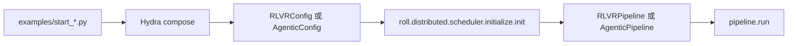
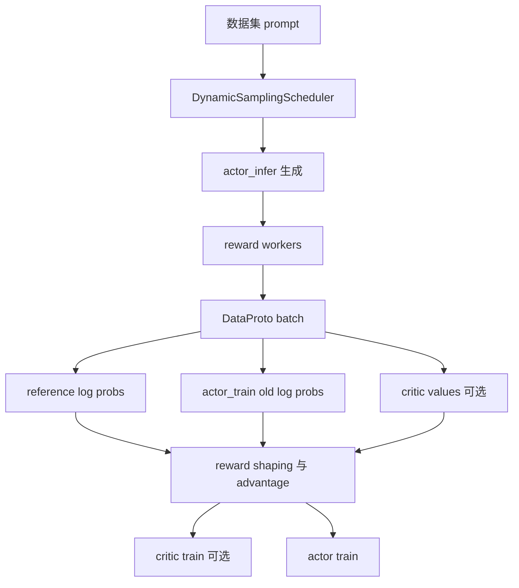
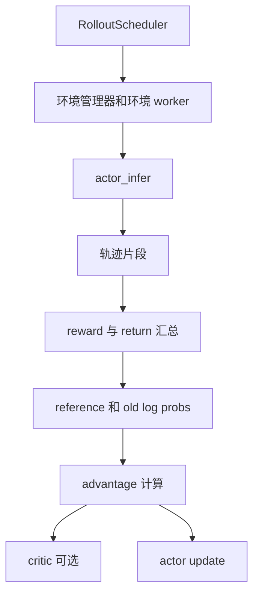

# ROLL 源码快速上手

这页是给“想先建立直觉，再下潜源码”的读者准备的。

## 1. 最短但足够有用的总结

ROLL 是一个面向 LLM / VLM 的大规模 RL 后训练框架。

它至少支持两条最核心的工作模式：

- **RLVR**：拿 prompt 生成回答，用规则/模型奖励打分，再更新策略。
- **Agentic RL**：让模型和环境或工具持续交互，收集轨迹，再更新策略。

这两条主线虽然业务形态不同，但底层复用的是同一套运行时思想：

- 基于 Ray 的多角色部署
- 显式资源映射与设备布局
- train / infer 分离
- 可插拔后端策略层
- 用 `DataProto` 作为统一 batch 协议

## 2. 从入口脚本切入最干净

最推荐的切入点是两个顶层启动脚本：

```bash
python examples/start_rlvr_pipeline.py --config_name sppo_config
python examples/start_agentic_pipeline.py --config_name sokoban_ppo_config
```

它们本质上都做了三件事：

1. 用 Hydra 读取配置；
2. 把配置物化成 dataclass；
3. 调用 `init()`，然后执行 `pipeline.run()`。



## 3. 最值得先读的 6 个文件

如果你只能先看 6 个文件，建议按这个顺序：

1. `README.md`
2. `examples/start_rlvr_pipeline.py`
3. `roll/pipeline/rlvr/rlvr_pipeline.py`
4. `roll/pipeline/agentic/agentic_pipeline.py`
5. `roll/distributed/executor/cluster.py`
6. `roll/pipeline/base_worker.py`

为什么这样排？

- 入口脚本告诉你控制平面长什么样；
- pipeline 告诉你训练循环怎么走；
- cluster 告诉你任务怎么落到机器和 GPU 上；
- worker 告诉你算法最终怎么打到模型张量上。

## 4. 主要目录分别在管什么

| 目录 | 角色 |
| --- | --- |
| `roll/pipeline/` | 训练循环和流水线编排 |
| `roll/distributed/executor/` | Ray actor 组、worker 创建、rank 元信息 |
| `roll/distributed/scheduler/` | rollout、路由、批处理、请求协调 |
| `roll/distributed/strategy/` | 训练/推理后端抽象层 |
| `roll/models/` | 模型、tokenizer、provider 工厂 |
| `roll/utils/` | RL 数学、mask、KL、负载均衡、offload 辅助逻辑 |
| `examples/` | 可运行的配置与入口示例 |

## 5. 怎么跟一遍 RLVR batch

你可以把一个 batch 想成一个会被“组装、打分、重塑、再送进梯度更新”的包裹。



## 6. 怎么跟一遍 Agentic batch

Agentic RL 和 RLVR 的最大区别是：经验不是来自单次 prompt，而是来自环境循环。



## 7. 一个很实用的阅读技巧

**不要** 一上来就钻 `megatron_strategy.py` 这类后端文件。

真正更高效的顺序是先搞清楚三件不变量：

- pipeline 决定全局训练节奏；
- cluster 决定分布式执行与资源摆放；
- worker/strategy 决定模型侧真正执行什么。

一旦这三件事通了，后面的后端细节会顺很多。

## 8. 下一站

- 看源码阅读顺序：[`source-reading-roadmap.md`](source-reading-roadmap.md)
- 看系统骨架：[`architecture/overview.md`](architecture/overview.md)
- 看公式和直觉：[`math-theory.md`](math-theory.md)
