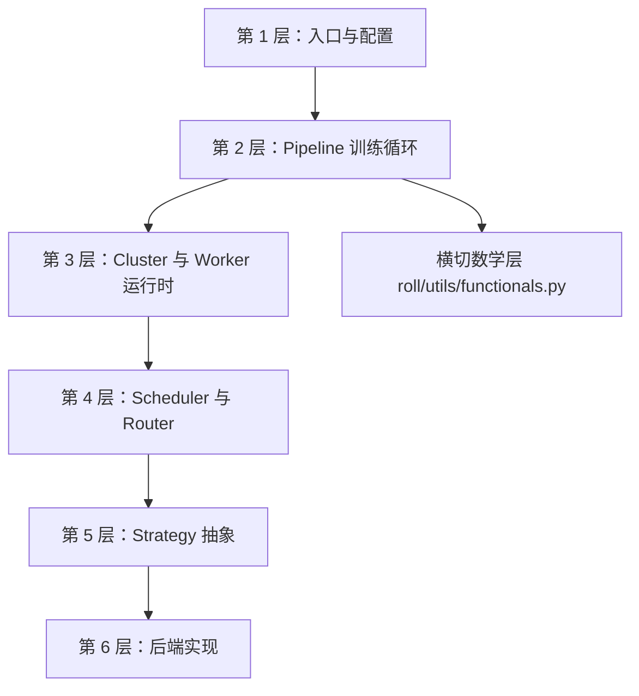
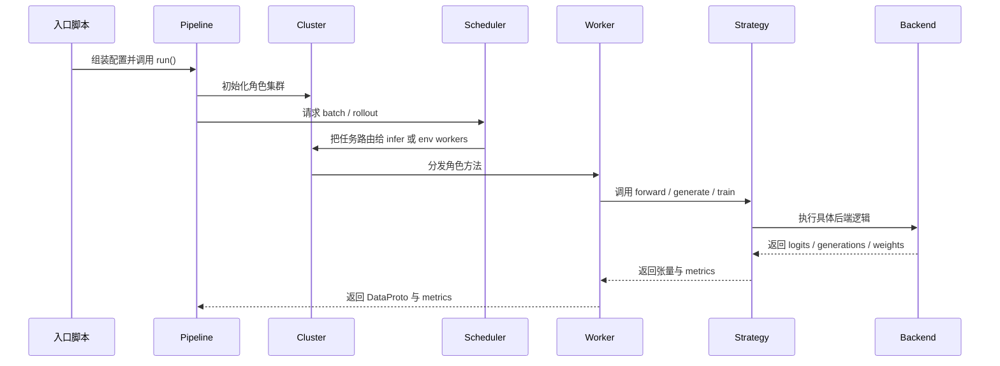

# 源码阅读路线图

这一页是“问题到文件”的对照表：你脑子里有什么问题，就去开哪几个文件。

## 1. 按层读，而不是按文件名乱逛

ROLL 最适合从外层控制逻辑，一层层往里读到执行细节。

## 2. 按问题找文件

| 你的问题 | 优先打开哪些文件 |
| --- | --- |
| 训练是怎么被拉起来的？ | `examples/start_rlvr_pipeline.py`, `examples/start_agentic_pipeline.py` |
| 一个 pipeline 到底管哪些事？ | `roll/pipeline/base_pipeline.py` |
| RLVR 的主逻辑在哪？ | `roll/pipeline/rlvr/rlvr_pipeline.py`, `roll/pipeline/rlvr/rlvr_config.py` |
| Agentic RL 的主逻辑在哪？ | `roll/pipeline/agentic/agentic_pipeline.py`, `roll/pipeline/agentic/agentic_config.py` |
| worker 是怎么被部署到资源上的？ | `roll/distributed/scheduler/resource_manager.py`, `roll/distributed/executor/cluster.py` |
| Cluster 方法是怎么扇出到多 rank 的？ | `roll/distributed/scheduler/decorator.py` |
| 统一数据载体是什么？ | `roll/distributed/scheduler/protocol.py` |
| rollout 请求是怎么被调度的？ | `roll/distributed/scheduler/generate_scheduler.py`, `roll/distributed/scheduler/rollout_scheduler.py` |
| 推理请求怎么被路由和暂停？ | `roll/distributed/scheduler/router.py` |
| PPO loss 真正在哪里？ | `roll/pipeline/base_worker.py` |
| reward normalization 和 advantage 在哪？ | `roll/utils/functionals.py`, `roll/pipeline/agentic/utils.py` |
| 后端差异是如何被隐藏的？ | `roll/distributed/strategy/factory.py`, `roll/distributed/strategy/strategy.py` |
| NCCL group 是怎么被销毁再重建的？ | `roll/utils/offload_nccl.py` |

## 3. 最快的 RLVR 阅读路径

1. `examples/start_rlvr_pipeline.py`
2. `roll/pipeline/rlvr/rlvr_config.py`
3. `roll/pipeline/rlvr/rlvr_pipeline.py`
4. `roll/pipeline/base_pipeline.py`
5. `roll/distributed/executor/cluster.py`
6. `roll/pipeline/base_worker.py`
7. `roll/utils/functionals.py`
8. `roll/distributed/strategy/factory.py`

这条路径高效的原因是：

- 先看训练循环；
- 再看角色怎么被分配；
- 再看 loss 与 advantage；
- 最后看后端如何兑现这些接口。

## 4. 最快的 Agentic 阅读路径

1. `examples/start_agentic_pipeline.py`
2. `roll/pipeline/agentic/agentic_config.py`
3. `roll/pipeline/agentic/agentic_pipeline.py`
4. `roll/distributed/scheduler/rollout_scheduler.py`
5. `roll/distributed/scheduler/router.py`
6. `roll/pipeline/agentic/utils.py`
7. `roll/pipeline/base_worker.py`

## 5. 用“垂直切片”一路跟到底

如果你不喜欢分层读，而更喜欢沿着一次调用链一路跟到底，可以用这条纵切路径：

## 6. 一个很好的“停表”标准

当你能用自己的话回答下面三个问题时，就可以暂时停下，不必继续下潜：

- 是谁决定 **什么时候** 收 batch、什么时候训练？
- 是谁决定某个角色 **跑在哪些设备上**？
- 是谁决定一个后端 **怎样执行请求的操作**？

一旦这三件事通了，后面再看后端细节就不会乱。

## 7. 什么阅读方式最容易把自己绕晕

最不推荐的顺序是：

- 到处 `grep` 后端实现，
- 看几段 reward worker，
- 再跳回配置。

这种读法看起来很忙，实际上是在不断丢掉架构全景图。

## 8. 下一站

- 系统骨架：[`architecture/overview.md`](architecture/overview.md)
- 分发与 `DataProto`：[`architecture/dispatch-dataflow.md`](architecture/dispatch-dataflow.md)
- 数学与直觉：[`math-theory.md`](math-theory.md)
